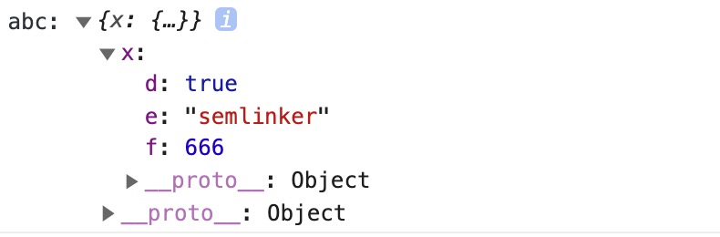

## 第四章 TS 中奇怪的符号

### 4.1 ！非空断言操作符

在上下文中当类型检查器无法断定类型时，一个新的后缀表达式操作符 ! 可以用于断言操作对象是非 null 和非 undefined 类型。具体而言，x! 将从 x 值域中排除 null 和 undefined 。

那么非空断言操作符到底有什么用呢？下面我们先来看一下非空断言操作符的一些使用场景。

#### 4.1.1 忽略 undefined 和 null

```typescript
function myFunc(maybeString: string | undefined | null) {
  // Type 'string | null | undefined' is not assignable to type 'string'.
  // Type 'undefined' is not assignable to type 'string'.
  const onlyString: string = maybeString; // Error
  const ignoreUndefinedAndNull: string = maybeString!; // Ok
}
```

#### 4.1.2 调用函数时忽略 undefined 类型

```typescript
type NumGenerator = () => number;

function myFunc(numGenerator: NumGenerator | undefined) {
  // Object is possibly 'undefined'.(2532)
  // Cannot invoke an object which is possibly 'undefined'.(2722)
  const num1 = numGenerator(); // Error
  const num2 = numGenerator!(); //OK
}
```

因为 ! 非空断言操作符会从编译生成的 JavaScript 代码中移除，所以在实际使用的过程中，要特别注意。比如下面这个例子：

```typescript
const a: number | undefined = undefined;
const b: number = a!;
console.log(b);
```

以上 TS 代码编译生成 ES5 代码：

```typescript
"use strict";
const a = undefined;
const b = a;
console.log(b);
```

虽然在 TS 代码中，我们使用了非空断言，使得 const b: number = a!; 语句可以通过 TypeScript 类型检查器的检查。但在生成的 ES5 代码中，! 非空断言操作符被移除了，所以在浏览器中执行以上代码，在控制台会输出 undefined。

### 4.2 ?. 运算符

TypeScript 3.7 实现了呼声最高的 ECMAScript 功能之一：可选链（Optional Chaining）。有了可选链后，我们编写代码时如果遇到 null 或 undefined 就可以立即停止某些表达式的运行。可选链的核心是新的 ?. 运算符，它支持以下语法：

```typescript
> obj?.prop
> obj?.[expr]
> arr?.[index]
> func?.(args)
>
```

这里我们来举一个可选的属性访问的例子：

```typescript
const val = a?.b;
```

为了更好的理解可选链，我们来看一下该 const val = a?.b 语句编译生成的 ES5 代码：

```typescript
var val = a === null || a === void 0 ? void 0 : a.b;
```

上述的代码会自动检查对象 a 是否为 null 或 undefined，如果是的话就立即返回 undefined，这样就可以立即停止某些表达式的运行。你可能已经想到可以使用 ?. 来替代很多使用 && 执行空检查的代码：

```typescript
if (a && a.b) {
}

if (a?.b) {
}
/**
 * if(a?.b){ } 编译后的ES5代码
 *
 * if(
 *  a === null || a === void 0
 *  ? void 0 : a.b) {
 * }
 */
```

但需要注意的是，?. 与 && 运算符行为略有不同，&& 专门用于检测 falsy 值，比如空字符串、0、NaN、null 和 false 等。而 ?. 只会验证对象是否为 null 或 undefined，对于 0 或空字符串来说，并不会出现 “短路”。

#### 4.2.1 可选元素访问

可选链除了支持可选属性的访问之外，它还支持可选元素的访问，它的行为类似于可选属性的访问，只是可选元素的访问允许我们访问非标识符的属性，比如任意字符串、数字索引和 Symbol：

```typescript
function tryGetArrayElement<T>(arr?: T[], index: number = 0) {
  return arr?.[index];
}
```

以上代码经过编译后会生成以下 ES5 代码：

```typescript
"use strict";
function tryGetArrayElement(arr, index) {
  if (index === void 0) {
    index = 0;
  }
  return arr === null || arr === void 0 ? void 0 : arr[index];
}
```

通过观察生成的 ES5 代码，很明显在 tryGetArrayElement 方法中会自动检测输入参数 arr 的值是否为 null 或 undefined，从而保证了我们代码的健壮性。

#### 4.2.2 可选链余函数调用

当尝试调用一个可能不存在的方法时也可以使用可选链。在实际开发过程中，这是很有用的。系统中某个方法不可用，有可能是由于版本不一致或者用户设备兼容性问题导致的。函数调用时如果被调用的方法不存在，使用可选链可以使表达式自动返回 undefined 而不是抛出一个异常。

可选调用使用起来也很简单，比如：

```typescript
let result = obj.customMethod?.();
```

该 TypeScript 代码编译生成的 ES5 代码如下：

```typescript
var result =
  (_a = obj.customMethod) === null || _a === void 0 ? void 0 : _a.call(obj);
```

另外在使用可选调用的时候，我们要注意以下两个注意事项：

- **如果存在一个属性名且该属性名对应的值不是函数类型，使用 ?. 仍然会产生一个 TypeError 异常。**

- **可选链的运算行为被局限在属性的访问、调用以及元素的访问 —— 它不会沿伸到后续的表达式中，也就是说可选调用不会阻止 a?.b / someMethod() 表达式中的除法运算或 someMethod 的方法调用。**

### 4.3 ?? 空值合并运算符

在 TypeScript 3.7 版本中除了引入了前面介绍的可选链 ?. 之外，也引入了一个新的逻辑运算符 —— 空值合并运算符 ??。**当左侧操作数为 null 或 undefined 时，其返回右侧的操作数，否则返回左侧的操作数。**

与逻辑或 || 运算符不同，逻辑或会在左操作数为 falsy 值时返回右侧操作数。也就是说，如果你使用 || 来为某些变量设置默认的值时，你可能会遇到意料之外的行为。比如为 falsy 值（’’、NaN 或 0）时。

这里来看一个具体的例子：

```typescript
const foo = null ?? "default string";
console.log(foo); // 输出："default string"
const baz = 0 ?? 42;
console.log(baz); // 输出：0
```

编译之后，生成 ES5 代码：

```typescript
"use strict";
var _a, _b;
var foo = (_a = null) !== null && _a !== void 0 ? _a : "default string";
console.log(foo); // 输出："default string"

var baz = (_b = 0) !== null && _b !== void 0 ? _b : 42;
console.log(baz); // 输出：0
```

通过观察以上代码，我们更加直观的了解到，空值合并运算符是如何解决前面 || 运算符存在的潜在问题。下面我们来介绍空值合并运算符的特性和使用时的一些注意事项。

#### 4.3.1 短路

当空值合并运算符的左表达式不为 null 或 undefined 时，不会对右表达式进行求值。

```typescript
function A() {
  console.log("A was called");
  return undefined;
}
function B() {
  console.log("B was called");
  return false;
}
function C() {
  console.log("C was called");
  return "foo";
}

console.log(A() ?? C());
console.log(B() ?? C());
```

上述代码运行后，控制台会输出以下结果：

```typescript
A was called
C was called
foo
B was called
false
```

#### 4.3.2 不可以和&&或｜｜ 操作符共运

若空值合并运算符 ?? 直接与 AND（&&）和 OR（||）操作符组合使用 ?? 是不行的。这种情况下会抛出 SyntaxError。

```typescript
// '||' and '??' operations cannot be mixed without parentheses.(5076)
(null || undefined) ?? "foo"; // raises a SyntaxError

// '&&' and '??' operations cannot be mixed without parentheses.(5076)
(true && undefined) ?? "foo"; // raises a SyntaxError
```

但当使用括号来显式表明优先级时是可行的，比如：

```typescript
(null || undefined) ?? "foo"; // 返回 "foo"
```

#### 4.3.3 与可选链操作符？.关系

空值合并运算符针对 undefined 与 null 这两个值，可选链式操作符 ?. 也是如此。可选链式操作符，对于访问属性可能为 undefined 与 null 的对象时非常有用。

```typescript
interface Customer {
  name: string;
  city?: string;
}

let customer: Customer = {
  name: "Semlinker",
};

let customerCity = customer?.city ?? "Unknown city";
console.log(customerCity); // 输出：Unknown city
```

前面我们已经介绍了空值合并运算符的应用场景和使用时的一些注意事项，该运算符不仅可以在 TypeScript 3.7 以上版本中使用。当然你也可以在 JavaScript 的环境中使用它，但你需要借助 Babel，在 Babel 7.8.0 版本也开始支持空值合并运算符。

### 4.4 可选属性?:

在面向对象语言中，接口是一个很重要的概念，它是对行为的抽象，而具体如何行动需要由类去实现。 **_TypeScript 中的接口是一个非常灵活的概念，除了可用于对类的一部分行为进行抽象以外，也常用于对「对象的形状（Shape）」进行描述。_**
在 TypeScript 中使用 interface 关键字就可以声明一个接口：

```typescript
interface Person {
  name: string;
  age: number;
}

let semlinker: Person = {
  name: "semlinker",
  age: 33,
};
```

在以上代码中，我们声明了 Person 接口，它包含了两个必填的属性 name 和 age。在初始化 Person 类型变量时，如果缺少某个属性，TypeScript 编译器就会提示相应的错误信息，比如：

```typescript
// Property 'age' is missing in type '{ name: string; }' but required in type 'Person'.(2741)
let lolo: Person = {
  // Error
  name: "lolo",
};
```

为了解决上述的问题，我们可以把某个属性声明为可选的：

```typescript
interface Person {
  name: string;
  age?: number;
}

let lolo: Person = {
  name: "lolo",
};
```

#### 4.4.1 工具 Partial&lt;T&gt;

在实际项目开发过程中，为了提高代码复用率，我们可以利用 TypeScript 内置的工具类型 Partial&lt;T&gt; 来快速把某个接口类型中定义的属性变成可选的：

```typescript
interface PullDownRefreshConfig {
  threshold: number;
  stop: number;
}

/**
 * type PullDownRefreshOptions = {
 *   threshold?: number | undefined;
 *   stop?: number | undefined;
 * }
 */
type PullDownRefreshOptions = Partial<PullDownRefreshConfig>;
```

是不是觉得 Partial<T> 很方便，下面让我们来看一下它是如何实现的：

```typescript
/**
 * Make all properties in T optional
 */
type Partial<T> = {
  [P in keyof T]?: T[P];
};
```

#### 4.4.2 工具 Required&lt;T&gt;

既然可以快速地把某个接口中定义的属性全部声明为可选，那能不能把所有的可选的属性变成必选的呢？答案是可以的，针对这个需求，我们可以使用 Required<T> 工具类型，具体的使用方式如下：

```typescript
interface PullDownRefreshConfig {
  threshold: number;
  stop: number;
}

type PullDownRefreshOptions = Partial<PullDownRefreshConfig>;

/**
 * type PullDownRefresh = {
 *   threshold: number;
 *   stop: number;
 * }
 */
type PullDownRefresh = Required<Partial<PullDownRefreshConfig>>;
```

同样，我们来看一下 Required<T> 工具类型是如何实现的：

```typescript
/**
 * Make all properties in T required
 */
type Required<T> = {
  [P in keyof T]-?: T[P];
};
```

原来在 Required&lt;T&gt;
工具类型内部，通过 -? 移除了可选属性中的 ?，使得属性从可选变为必选的。

### 4.5 & 运算符

在 TypeScript 中交叉类型是将多个类型合并为一个类型。通过 & 运算符可以将现有的多种类型叠加到一起成为一种类型，它包含了所需的所有类型的特性。

```typescript
type PartialPointX = { x: number };
type Point = PartialPointX & { y: number };

let point: Point = {
  x: 1,
  y: 1,
};
```

在上面代码中我们先定义了 PartialPointX 类型，接着使用 & 运算符创建一个新的 Point 类型，表示一个含有 x 和 y 坐标的点，然后定义了一个 Point 类型的变量并初始化。

#### 4.5.1 同名基础类型属性的合并

那么现在问题来了，假设在合并多个类型的过程中，刚好出现某些类型存在相同的成员，但对应的类型又不一致，比如：

```typescript
interface X {
  c: string;
  d: string;
}

interface Y {
  c: number;
  e: string;
}

type XY = X & Y;
type YX = Y & X;

let p: XY;
let q: YX;
```

在上面的代码中，接口 X 和接口 Y 都含有一个相同的成员 c，但它们的类型不一致。对于这种情况，此时 XY 类型或 YX 类型中成员 c 的类型是不是可以是 string 或 number 类型呢？比如下面的例子：

```typescript
p = { c: 6, d: "d", e: "e" };
```


```typescript
q = { c: "c", d: "d", e: "e" };
```


#### 4.5.2 同名非基础类型属性的合并

在上面示例中，刚好接口 X 和接口 Y 中内部成员 c 的类型都是基本数据类型，那么如果是非基本数据类型的话，又会是什么情形。我们来看个具体的例子：

```typescript
interface D {
  d: boolean;
}
interface E {
  e: string;
}
interface F {
  f: number;
}

interface A {
  x: D;
}
interface B {
  x: E;
}
interface C {
  x: F;
}

type ABC = A & B & C;

let abc: ABC = {
  x: {
    d: true,
    e: "semlinker",
    f: 666,
  },
};

console.log("abc:", abc);
```

以上代码成功运行后，控制台会输出以下结果：

由上图可知，在混入多个类型时，若存在相同的成员，且成员类型为非基本数据类型，那么是可以成功合并。

### 4.6 ｜ 分隔符

在 TypeScript 中联合类型（Union Types）表示取值可以为多种类型中的一种，联合类型使用 | 分隔每个类型。联合类型通常与 null 或 undefined 一起使用：

```typescript
const sayHello = (name: string | undefined) => {
  /* ... */
};
```

以上示例中 name 的类型是 string | undefined 意味着可以将 string 或 undefined 的值传递给 sayHello 函数。

```typescript
sayHello("semlinker");
sayHello(undefined);
```

此外，对于联合类型来说，你可能会遇到以下的用法：

```typescript
let num: 1 | 2 = 1;
type EventNames = "click" | "scroll" | "mousemove";
```

示例中的 1、2 或 'click' 被称为字面量类型，用来约束取值只能是某几个值中的一个。

#### 4.6.1 类型保护

当使用联合类型时，我们必须尽量把当前值的类型收窄为当前值的实际类型，而类型保护就是实现类型收窄的一种手段。

类型保护是可执行运行时检查的一种表达式，用于确保该类型在一定的范围内。换句话说，类型保护可以保证一个字符串是一个字符串，尽管它的值也可以是一个数字。类型保护与特性检测并不是完全不同，其主要思想是尝试检测属性、方法或原型，以确定如何处理值。

目前主要有四种的方式来实现类型保护：

- in 关键字

```typescript
interface Admin {
  name: string;
  privileges: string[];
}

interface Employee {
  name: string;
  startDate: Date;
}

type UnknownEmployee = Employee | Admin;

function printEmployeeInformation(emp: UnknownEmployee) {
  console.log("Name: " + emp.name);
  if ("privileges" in emp) {
    console.log("Privileges: " + emp.privileges);
  }
  if ("startDate" in emp) {
    console.log("Start Date: " + emp.startDate);
  }
}
```

- typeof 关键字

```typescript
function padLeft(value: string, padding: string | number) {
  if (typeof padding === "number") {
    return Array(padding + 1).join(" ") + value;
  }
  if (typeof padding === "string") {
    return padding + value;
  }
  throw new Error(`Expected string or number, got '${padding}'.`);
}
```

typeof 类型保护只支持两种形式：typeof v === "typename" 和 typeof v !== typename，"typename" 必须是 "number"， "string"， "boolean" 或 "symbol"。 但是 TypeScript 并不会阻止你与其它字符串比较，语言不会把那些表达式识别为类型保护。

- instanceof 关键字

```typescript
interface Padder {
  getPaddingString(): string;
}

class SpaceRepeatingPadder implements Padder {
  constructor(private numSpaces: number) {}
  getPaddingString() {
    return Array(this.numSpaces + 1).join(" ");
  }
}

class StringPadder implements Padder {
  constructor(private value: string) {}
  getPaddingString() {
    return this.value;
  }
}

let padder: Padder = new SpaceRepeatingPadder(6);

if (padder instanceof SpaceRepeatingPadder) {
  // padder的类型收窄为 'SpaceRepeatingPadder'
}
```

- 自定义类型保护的(is)类型谓词（type predicate）

```typescript
function isNumber(x: any): x is number {
  return typeof x === "number";
}

function isString(x: any): x is string {
  return typeof x === "string";
}
```
