## 1.Type Manipulation 类型操作

::: tip
在掌握 TS 基本的类型知识知识后，面对复杂的源码和复杂类型逻辑，我们仍然束手无策。其实我们还需要再次基础之上，将基础类型联合起来做出更多优雅的类型声明。TypeScript 中有很多关键字，如果不去主动接触的话就会少了很多可操作性。例如：infer、keyof、typeof、extends 之类的。还有映射和模板字符串这种概念
:::

### 1.1 范型

```typescript
function identity<Type>(arg: Type): Type {
  return arg;
}
let myIdentity: <Input>(arg: Input) => Input = identity
or
function identity<Type>(arg: Type): Type {
  return arg;
}
let myIdentity: { <Type>(arg: Type): Type } = identity;
接口形式定义：
interface GenericIdentifyFn {
    <T>(arg: T): T
}

function identify<T>(arg: T): T {
    return arg
}
let myIdentify: GenericIdentifyFn = identify

```

### 1.2 keyof 类型操作符

TypeScript 允许我们遍历某种类型的属性，并通过 keyof 操作符提取其属性的名称。keyof 操作符是在 TypeScript 2.1 版本引入的，该操作符可以用于获取某种类型的所有键，其返回类型是联合类型。

#### keyof 介绍

- 接口

```typescript
interface Person{
name:string;
age:number;
location:string;
}
type K1=keyof Person;//"name"| "age"|"localtion"
type K2=keyof Person[] // numner|"length"|"push"....
type K3 keyof {[x:string]:Person};//string|number
```

::: info
K3 返回 string ｜ number 是因为：在 js 中，对象的 key，obj[1]==obj["1"]
:::

- 类
  除了接口外，keyof 也可以用于操作类，比如：

```typescript
class Person {
  name: string = "Semlinker";
}
let sname: keyof Person;
sname = "name";
```

若把 sname = "name" 改为 sname = "age" 的话，TypeScript 编译器会提示以下错误信息：

```typescript
Type '"age"' is not assignable to type '"name"'.
```

基本数据类型

```typescript
let K1: keyof boolean; // let K1: "valueOf"
let K2: keyof number; // let K2: "toString" | "toFixed" | "toExponential" | ...
let K3: keyof symbol; // let K1: "valueOf"
此外 keyof 也称为输入索引类型查询，与之相对应的是索引访问类型，也称为查找类型。在语法上，它们看起来像属性或元素访问，但最终会被转换为类型：
type P1 = Person["name"]; // string
type P2 = Person["name" | "age"]; // string | number
type P3 = string["charAt"]; // (pos: number) => string
type P4 = string[]["push"]; // (...items: string[]) => number
type P5 = string[][0]; // string
```

#### keyof 作用

JavaScript 是一种高度动态的语言。有时在静态类型系统中捕获某些操作的语义可能会很棘手。以一个简单的 prop 函数为例：

```typescript
function prop(obj, key) {
  return obj[key];
}
```

该函数接收 obj 和 key 两个参数，并返回对应属性的值。对象上的不同属性，可以具有完全不同的类型，我们甚至不知道 obj 对象长什么样。
那么在 TypeScript 中如何定义上面的 prop 函数呢？我们来尝试一下：

```typescript
function prop(obj: object, key: string) {
  return obj[key];
}
```

在上面代码中，为了避免调用 prop 函数时传入错误的参数类型，我们为 obj 和 key 参数设置了类型，分别为 {} 和 string 类型。然而，事情并没有那么简单。针对上述的代码，TypeScript 编译器会输出以下错误信息：

```typescript
Element implicitly has an 'any' type because expression of type 'string' can't be used to index type '{}'.
```

元素隐式地拥有 any 类型，因为 string 类型不能被用于索引 {} 类型。要解决这个问题，你可以使用以下非常暴力的方案：

```typescript
function prop(obj: object, key: string) {
  return (obj as any)[key];
}
```

很明显该方案并不是一个好的方案，我们来回顾一下 prop 函数的作用，该函数用于获取某个对象中指定属性的属性值。因此我们期望用户输入的属性是对象上已存在的属性，那么如何限制属性名的范围呢？这时我们可以利用本文的主角 keyof 操作符：

```typescript
function prop<T extends object, K extends keyof T>(obj: T, key: K) {
  return obj[key];
}
```

在以上代码中，我们使用了 TypeScript 的泛型和泛型约束。首先定义了 T 类型并使用 extends 关键字约束该类型必须是 object 类型的子类型，然后使用 keyof 操作符获取 T 类型的所有键，其返回类型是联合类型，最后利用 extends 关键字约束 K 类型必须为 keyof T 联合类型的子类型。 是骡子是马拉出来遛遛就知道了，我们来实际测试一下：

```typescript
type Todo = {
  id: number;
  text: string;
  done: boolean;
};

const todo: Todo = {
  id: 1,
  text: "Learn TypeScript keyof",
  done: false,
};

function prop<T extends object, K extends keyof T>(obj: T, key: K) {
  return obj[key];
}

const id = prop(todo, "id"); // const id: number
const text = prop(todo, "text"); // const text: string
const done = prop(todo, "done"); // const done: boolean
```

很明显使用泛型，重新定义后的 prop<T extends object, K extends keyof T>(obj: T, key: K) 函数，已经可以正确地推导出指定键对应的类型。那么当访问 todo 对象上不存在的属性时，会出现什么情况？比如：

```typescript
const date = prop(todo, "date");
```

对于上述代码，TypeScript 编译器会提示以下错误：

```typescript
Argument of type '"date"' is not assignable to parameter of type '"id" | "text" | "done"'.
```

这就阻止我们尝试读取不存在的属性

#### keyof 与对象的数值属性

在使用对象的数值属性时，我们也可以使用 keyof 关键字。请记住，如果我们定义一个带有数值属性的对象，那么我们既需要定义该属性，又需要使用数组语法访问该属性， 如下所示：

```typescript
lass ClassWithNumericProperty {
[1]: string = "Semlinker";
}

let classWithNumeric = new ClassWithNumericProperty();
console.log(`${classWithNumeric[1]} `);
```

下面我们来举个示例，介绍一下在含有数值属性的对象中，如何使用 keyof 操作符来安全地访问对象的属性：

```typescript
enum Currency {
  CNY = 6,
  EUR = 8,
  USD = 10,
}

const CurrencyName = {
  [Currency.CNY]: "人民币",
  [Currency.EUR]: "欧元",
  [Currency.USD]: "美元",
};

console.log(`CurrencyName[Currency.CNY] = ${CurrencyName[Currency.CNY]}`);
console.log(`CurrencyName[36] = ${CurrencyName[6]}`);
```

上面的代码中，首先定义了一个 Currency 枚举用于表示三种货币类型，接着定义一个 CurrencyName 对象，该对象使用数值属性作为键，对应的值是该货币类型的名称。该代码成功运行后，控制台会输出以下结果：

```
CurrencyName[Currency.CNY] = 人民币
CurrencyName[36] = 人民币
```

为了方便用户能根据货币类型来获取对应的货币名称，我们来定义一个 getCurrencyName 函数，具体实现如下：

```typescript
function getCurrencyName<T, K extends keyof T>(key: K, map: T): T[K] {
  return map[key];
}

console.log(`name = ${getCurrencyName(Currency.CNY, CurrencyName)}`);
```

同样，getCurrencyName 函数和前面介绍的 prop 函数一样，使用了泛型和泛型约束，从而来保证属性的安全访问。最后，我们来简单介绍一下 keyof 与 typeof 操作符如何配合使用。

#### keyof VS typeof 操作符

typeof 操作符用于获取变量的类型。因此这个操作符的后面接的始终是一个变量，且需要运用到类型定义当中。为了方便大家理解，我们来举一个具体的示例：

```typescript
type Person = {
  name: string;
  age: number;
};

let man: Person = {
  name: "Semlinker",
  age: 30,
};

type Human = typeof man;
```

了解完 typeof 和 keyof 操作符的作用，我们来举个例子，介绍一下它们如何结合在一起使用：

```typescript
const COLORS = {
  red: "red",
  blue: "blue",
};

// 首先通过 typeof 操作符获取 color 变量的类型，然后通过 keyof 操作符获取该类型的所有键，
// 即字符串字面量联合类型 'red' | 'blue'
type Colors = keyof typeof COLORS;
let color: Colors;
color = "red"; // Ok
color = "blue"; // Ok

// Type '"yellow"' is not assignable to type '"red" | "blue"'.
color = "yellow"; // Error
```

最后留到思考题，有兴趣的小伙伴可以想一想：

```typescript
interface StringIndexArray {
  [index: string]: string;
}

interface NumberIndexArray {
  [index: number]: string;
}

type K1 = keyof StringIndexArray; // type K1 = string | number
type K2 = keyof NumberIndexArray; // type K2 = number
```

#### 参考资料

● [keyof-and-lookup-types-in-typescript](https://mariusschulz.com/blog/keyof-and-lookup-types-in-typescript)<br/>
● [keyof-inferring-string-number-when-key-is-only-a-string](https://stackoverflow.com/questions/51808160/keyof-inferring-string-number-when-key-is-only-a-string)<br/>
● [typescriptlang - indexable-types](https://www.typescriptlang.org/docs/handbook/interfaces.html#indexable-types)

### 1.3 typeof 操作符

#### 简介

在 JavaScript 中，你可以通过 typeof 操作符获取变量的类型，在 TypeScript 中，typeof 操作符可以用来获取一个变量或对象的类型。

```typescript
interface Person {
  name: string;
  age: number;
}

const sem: Person = { name: "semlinker", age: 30 };
type Sem = typeof sem; // type Sem = Person
```

在上面代码中，我们通过 typeof 操作符获取 sem 变量的类型并赋值给 Sem 类型变量，之后我们就可以使用 Sem 类型：

```typescript
const lolo: Sem = { name: "lolo", age: 5 };
```

#### 应用场景

- 1.Get the type of the object
  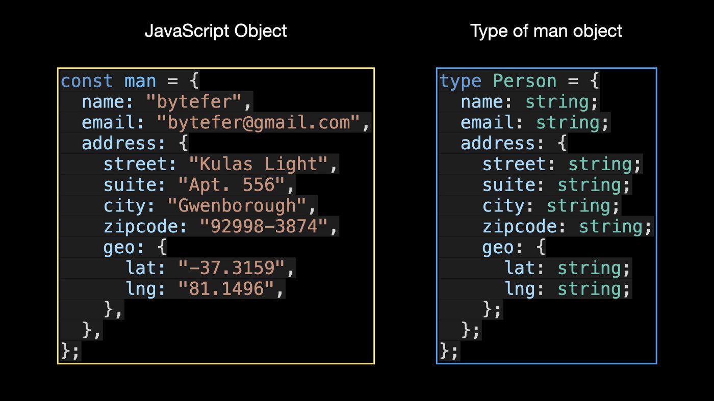
  man 对象是一个常规的 JavaScript 对象，在 TypeScript 中你可以使用类型或接口来定义对象的类型。使用此对象类型，您可以使用 TypeScript 的内置实用程序类型（例如 Partial、Required、Pick 或 Readonly）来处理对象类型以满足不同的需求。
  对于简单的对象，这可能没什么大不了的。但是对于嵌套层次更深的大型复杂对象，手动定义太麻烦。要解决这个问题，可以使用 typeof 运算符。

```typescript
type Person = typeof man;
type Address = Person["address"];
```

与之前手动定义类型相比，使用 typeof 运算符变得容易得多。 Person["address"] 是一种索引访问类型，用于在另一种类型（Person 类型）上查找特定属性（地址）。

- 2.Get a type That Represents All Enum Keys As Strings
  在 TypeScript 中，枚举类型是编译成常规 JavaScript 对象的特殊类型：
  
  因此，您还可以在枚举类型上使用 typeof 运算符。但这通常没有太大的实际用途，在处理枚举类型时，通常与 keyof 运算符结合使用：
  
- 3.Get the type of the Function Object
  还有另一种更常见的场景，在您的工作中使用 typeof 运算符。获取到对应的函数类型后，可以继续使用 TypeScript 内置的 ReturnType 和 Parameters 实用类型分别获取函数的返回值类型和参数类型。
  
- 4. Get the Type of the Class Object
     既然 typeof 操作符可以处理函数对象，那么它可以处理 Class 对象吗？答案是肯定的。
     
     在上面的代码中，createPoint 是一个工厂函数，它创建了一个 Point 类的实例。通过 typeof 操作符可以获取 Point 类对应的构造签名，从而实现对应的类型校验。在定义 Constructor 的参数类型时，如果没有使用 typeof 操作符，会出现如下错误信息：
     
- 5. Get a More Precise Type
     在使用 typeof 运算符时，如果你想得到更精确的类型，那么可以将它与 TypeScript 3.4 版本中引入的 const 断言结合起来。这以以下方式使用。
     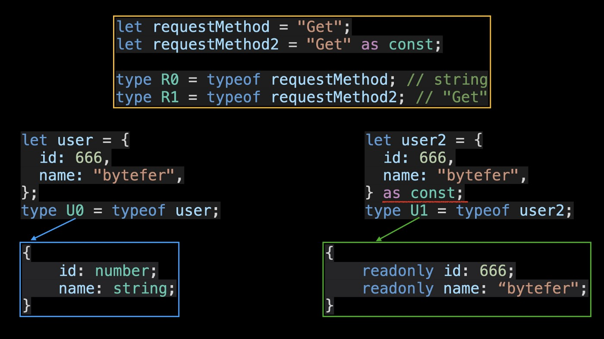
     从上图可以看出，在使用了 const 断言之后，再使用 typeof 操作符，我们可以得到更精确的类型。

#### const 断言

TypeScript 3.4 引入了一种新的字面量构造方式，也称为 const 断言。当我们使用 const 断言构造新的字面量表达式时，我们可以向编程语言发出以下信号：
● 表达式中的任何字面量类型都不应该被扩展；
● 对象字面量的属性，将使用 readonly 修饰；
● 数组字面量将变成 readonly 元组。
下面我们来举一个 const 断言的例子：

```typescript
let x = "hello" as const;
type X = typeof x; // type X = "hello"

let y = [10, 20] as const;
type Y = typeof y; // type Y = readonly [10, 20]

let z = { text: "hello" } as const;
type Z = typeof z; // let z: { readonly text: "hello"; }
```

数组字面量应用 const 断言后，它将变成 readonly 元组，之后我们还可以通过 typeof 操作符获取元组中元素值的联合类型，具体如下：
这同样适用于包含引用类型的数组，比如包含普通的对象的数组。这里我们也来举一个具体的例子：

```typescript
const locales = [
  {
    locale: "zh-CN",
    language: "中文",
  },
  {
    locale: "en",
    language: "English",
  },
] as const;

// type Locale = "zh-CN" | "en"
type Locale = typeof locales[number]["locale"];
```

另外在使用 const 断言的时候，我们还需要注意以下两个注意事项：
● const 断言只适用于简单的字面量表达式

```typescript
// A 'const' assertions can only be applied to references to enum members,
// or string, number, boolean, array, or object literals.
let a = (Math.random() < 0.5 ? 0 : 1) as const; // error

let b = Math.random() < 0.5 ? (0 as const) : (1 as const);
```

● const 上下文不会立即将表达式转换为完全不可变

```typescript
let arr = [1, 2, 3, 4];
let foo = {
  name: "foo",
  contents: arr,
} as const;

foo.name = "bar"; // error!
foo.contents = []; // error!

foo.contents.push(5); // ...works!
```

#### typeof 和 keyof 操作符

在 TypeScript 中，typeof 操作符可以用来获取一个变量或对象的类型。而 keyof 操作符可以用于获取某种类型的所有键，其返回类型是联合类型。了解完 typeof 和 keyof 操作符的作用，我们来举个例子，介绍一下它们如何结合在一起使用：

```typescript
const COLORS = {
  red: "red",
  blue: "blue",
};

// 首先通过 typeof 操作符获取 Colors 变量的类型，然后通过 keyof 操作符获取该类型的所有键，
// 即字符串字面量联合类型 'red' | 'blue'
type Colors = keyof typeof COLORS;
let color: Colors;
color = "red"; // Ok
color = "blue"; // Ok

// Type '"yellow"' is not assignable to type '"red" | "blue"'.
color = "yellow"; // Error
```

#### 参考资料

● typescript-get-types-from-data-using-typeof
● 5 Very Useful Tricks for TypeScript Typeof Operator

### 1.4 条件类型

您是否使用过 Exclude、Extract、NonNullable、Parameters 和 ReturnType 实用程序类型？ 你知道他们在内部是如何工作的吗？ 其实上面的 TypeScript 内置的实用程序类型都是基于条件开发的。

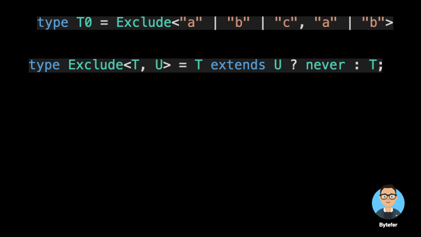

#### 介绍

条件类型（Conditional Types）有助于描述输入与输出类型之间的关系。

```typescript
interface Animal {
  live(): void;
}
interface Dog extends Animal {
  woof(): void;
}
type Example1 = Dog extends Animal ? number : string;
//type Example1 = number
type Example2 = RegExp extends Animal ? number : string;
//type Example2 = string
```

#### extend 用于条件判断时以下规律

● 若位于 extends 两侧的类型相同，则 extends 在语义上可以理解为===，如：

```typescript
type A =
  | Without<boolean, boolean>
  | Without<number, boolean>
  | Without<string, boolean>;
```

● 若 extends 右侧类型位于 extends 左侧，即右侧类型更广泛，则 true，反之 false

```typescript
type result3 = string extends string | number ? true : false; // true
```

● extends 用作对象，对象中指定 key 越多，则其类型定义的范围越狭窄，即右侧 key 包含左侧 key

```typescript
type result4 = { a: true; b: false } extends { a: true } ? true : false; // true
```

#### 分布式条件类型

条件类型还有一个特性：分布式条件类型。在结合联合类型使用时（只针对 extends 左边的联合类型），分布式条件类型会被自动分发成联合类型。


```typescript
string extends T ? A : B   等价于  string extends T ? A : B
(string | number) extends T ? A : B 等价于 (string extends T ? A : B) | (number extends T ? A : B)
(string | number | boolean) extends T ? A : B 等价于 (string extends T ? A : B) | (number extends T ? A : B) | (boolean extends T ? A : B)
```

eg：假设我们有一个泛型类型 Widthout<T,U>,用于筛选在 T 但是不在 U 中的类型：

```typescript
type Without<T, U> = T extends U ? never : T;
```

如：

```typescript
type A = Without<boolean | number | string, boolean>; // number | string
```

分析：
● 给泛型执行具体类型

```typescript
type A = Without<boolean | number | string, boolean>;
```

● 自动分发为联合类型

```typescript
type A =
  | Without<boolean, boolean>
  | Without<number, boolean>
  | Without<string, boolean>;
```

● 替换为具体定义

```typescript
type A =
  | (boolean extends boolean ? never : boolean)
  | (number extends boolean ? never : number)
  | (string extends boolean ? never : string);
```

● 结果

```typescript
type A = number | string;
```

分布式条件
在官方文档中提到，分布式条件类型是有前提的。条件类型中待检查的类型（即 extends 左边的类型）必须是裸类型（naked type parameter）。即没有被诸如数组，元组或者函数包裹。


```typescript
// naked type
type NakedType<T> = T extends boolean ? "yes" : "no";
type DistributedUsage = NakedType<number | boolean>; // "yes" | "no"

// wrapped type
type WrappedType<T> = Array<T> extends Array<boolean> ? "yes" : "no";
type NonDistributedUsage = WrappedType<number | boolean>; // "no"
```

#### 类型推断 infer

在条件类型语句中，可以用 infer 声明一个类型变量并且对它进行使用。
推断用于声明一个类型变量，以存储模式匹配期间捕获的类型。
您知道如何获取 T0 数组类型中的元素类型和 T1 函数类型中的返回值类型吗？

```typescript
type T0 = string[];
type T1 = () => string;
```

条件类型允许我们检测两种类型之间的关系，通过条件类型，我们可以确定两种类型是否兼容。推断用于声明一个类型变量，以存储模式匹配期间捕获的类型。
下边是如何捕获 T0 数组类型中的元素类型。
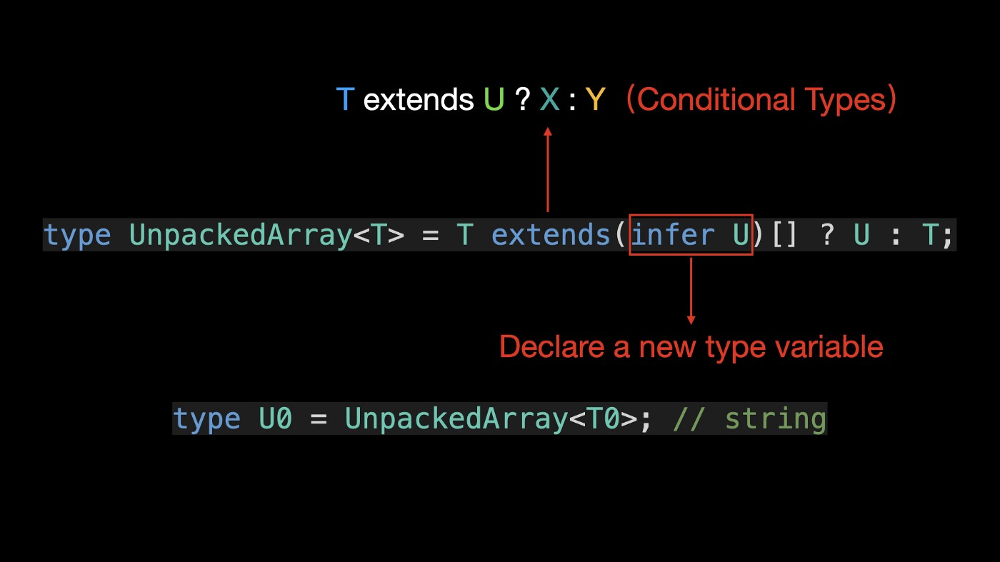
T extends (infer U)[] ? U : T 是条件类型语法 info U 是引入的新的类型变量来存储推类型。
接下来看看实用类型 UnpackedArray 的执行过程。


注意：需要注意的是，推断只能在条件类型的扩展子句中使用，而推断声明的类型变量只能在条件类型的 true 分支中使用。

```typescript
type Wrong1<T extends (infer U)[]> = T[0]; // Error
type Wrong2<T> = (infer U)[] extends T ? U : T; // Error
type Wrong3<T> = T extends (infer U)[] ? T : U; // Error
```


- 获取返回值类型

```typescript
type UnpackedFn<T> = T extends (...args: any[]) => infer U ? U : T;
type U1 = UnpackedFn<T1>; // string
```

当涉及到函数重载场景时，TypeScript 将使用最后一个调用签名进行类型推断。


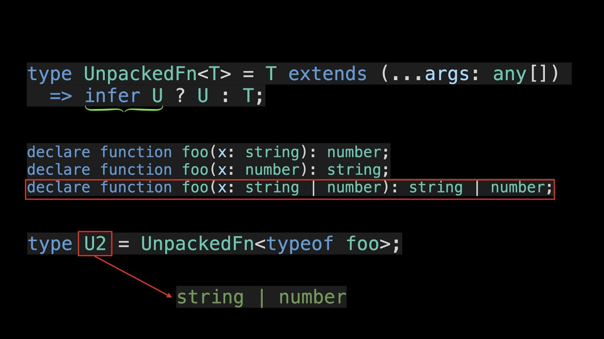

- 推断对象类型

```typescript
type User = {
  id: number;
  name: string;
};

type PropertyType<T> = T extends { id: infer U; name: infer R } ? [U, R] : T;
type U3 = PropertyType<User>; // [number, string]
```


在 PropertyType 实用程序类型中，我们使用 infer 来声明两个类型变量 u 和 R，它们分别表示对象类型中 id 和 name 属性的类型。如果类型匹配，我们将 id 和 name 属性的类型作为元组返回。
如果在 PropertyType 实用程序类型中只声明一个类型变量 U，结果会是什么？

```typescript
type PropertyType<T> = T extends { id: infer U; name: infer U } ? U : T;

type U4 = PropertyType<User>; // string | number
```


U4 类型返回字符串和数字类型的联合。为什么它会返回这样的结果？这是因为，如果在协变位置存在同一类型变量的多个候选变量，则最终类型将被推断为联合类型。
但是，在逆变位置，如果同一类型变量有多个候选变量，则最终类型将被推断为交集类型。

```typescript
type Bar<T> = T extends { a: (x: infer U) => void; b: (x: infer U) => void }
  ? U
  : never;

type U5 = Bar<{ a: (x: string) => void; b: (x: number) => void }>; // string & number
```


U5 类型返回由字符串和数字类型组成的交集类型，即最终类型从不为类型。

### 1.5 映射类型 Mapped Type

在数学中，映射是指两个元素的集合之间元素相互对应的关系，可以将映射理解为函数，如上图，当我们需要将集合 A 的元素转换为集合 B 的元素，可以通过 f 函数做映射，比如将集合 A 的元素 1 对应到集合 B 中的元素 2。

##### 介绍

你知道 Partial, Required, Readonly, 和 Pick 实用类型的实现原理吗？

在这里，我们可以使用 TypeScript 来定义一个需要所有键的用户类型。

```typescript
type User = {
  name: string;
  password: string;
  address: string;
  phone: string;
};
```

通常，对于注册用户，我们只允许用户修改部分用户信息。此时，我们可以定义一个新的 UserPartial 类型，该类型表示要更新的用户对象的类型，其中所有键都是可选的。

```typescript
type UserPartial = {
  name?: string;
  password?: string;
  address?: string;
  phone?: string;
};
```

对于查看用户信息的场景，我们希望用户对象对应的对象类型中的所有键都是只读的。对于此要求，我们可以定义只读用户类型。

```typescript
type ReadonlyUser = {
  readonly name: string;
  readonly password: string;
  readonly address: string;
  readonly phone: string;
};
```


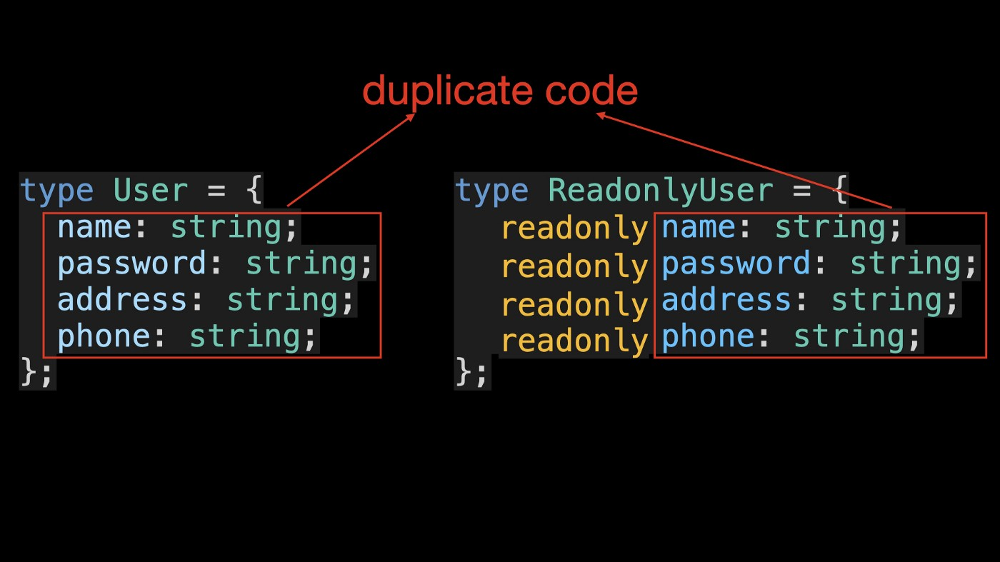
使用映射类型减少重复代码，映射类型是可用于将原始对象类型映射到新对象类型的泛型类型。

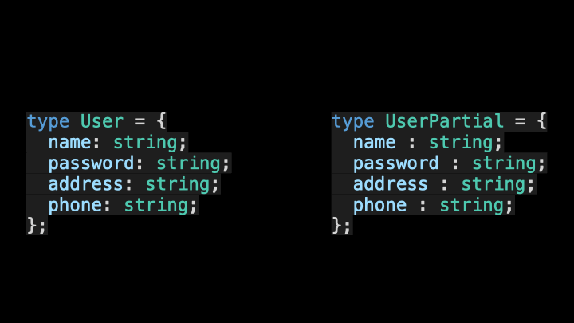

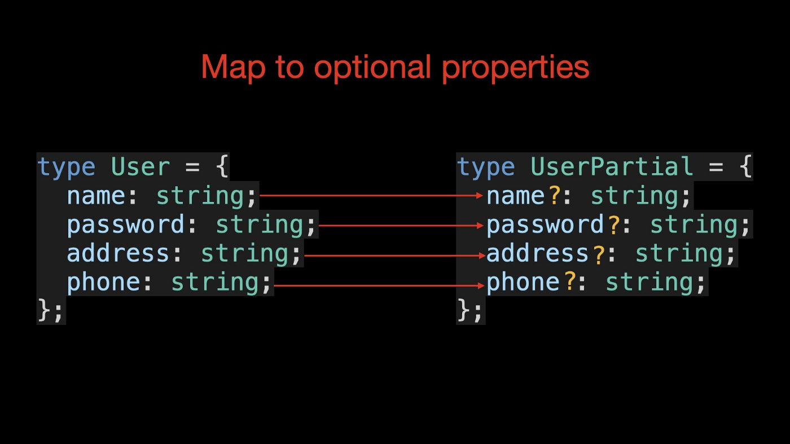
查看已经定义的三个与用户相关的类型，您会发现它们包含大量重复的代码。
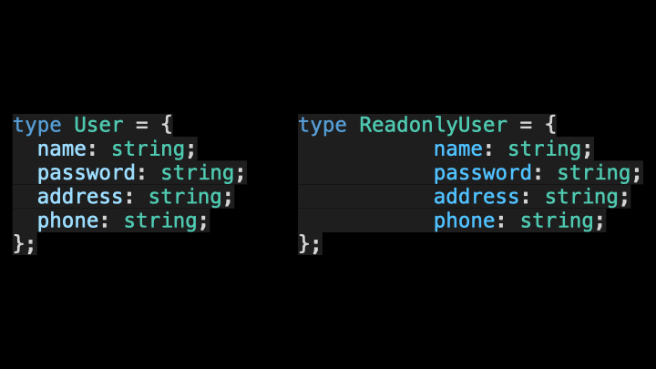

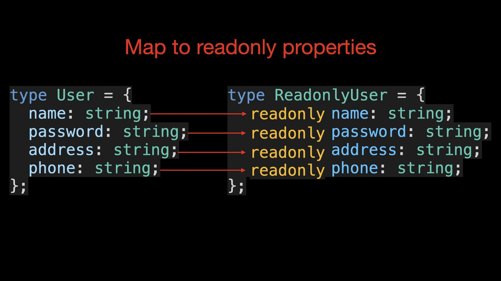

#### 映射语法：

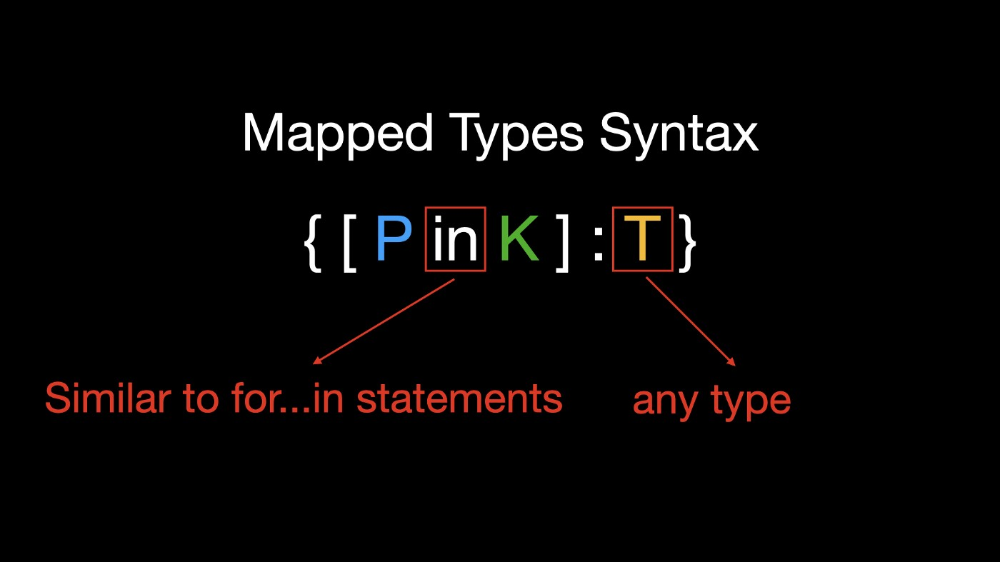
其中

- ● P in K 类似于 JavaScript for. . .in 语句，用于遍历类型 K 中的所有类型，
- ● 以及 T 类型变量，用于表示 TypeScript 中的任何类型。
  
  您还可以在映射过程中使用附加的修饰符只读和问号 (?)。通过添加加号（+）和减号（-）前缀来添加和删除相应的修饰符。如果没有添加前缀，则默认使用加号。

```typescript
{ [ P in K ] : T }
{ [ P in K ] ?: T }
{ [ P in K ] -?: T }
{ readonly [ P in K ] : T }
{ readonly [ P in K ] ?: T }
{ -readonly [ P in K ] ?: T }
```

eg
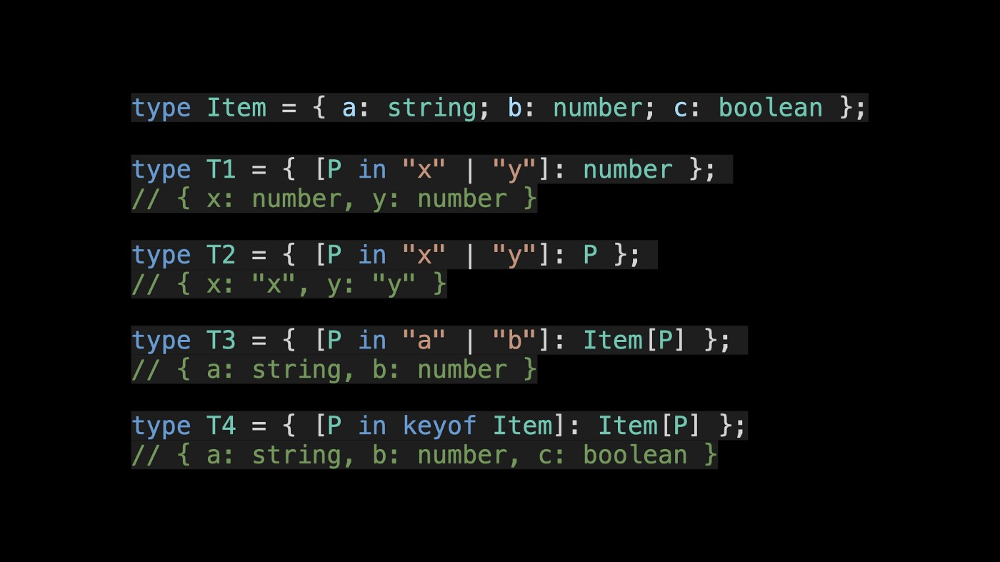

```typescript
type MyPartial<T> = {
  [P in keyof T]?: T[P];
};
type UserPartial = MyPartial<User>;
```

- ● in：类似 JS 中 for...in 中的 in，用来遍历目标类型的公开属性名；
- ● T[P]：是个索引访问类型（也称查找类型），获取泛型 T 中 P 类型，类似 JS 中的访问对象的方式；
- ● ?:将类型值设置为可选类型；
- ● { [P in keyof T] ?: T[P] | undefined}：遍历 keyof T 返回的联合类型，并定义用 P 变量接收，其每次遍历返回的值为可选类型的 T[P]。
  映射完整演示
  

  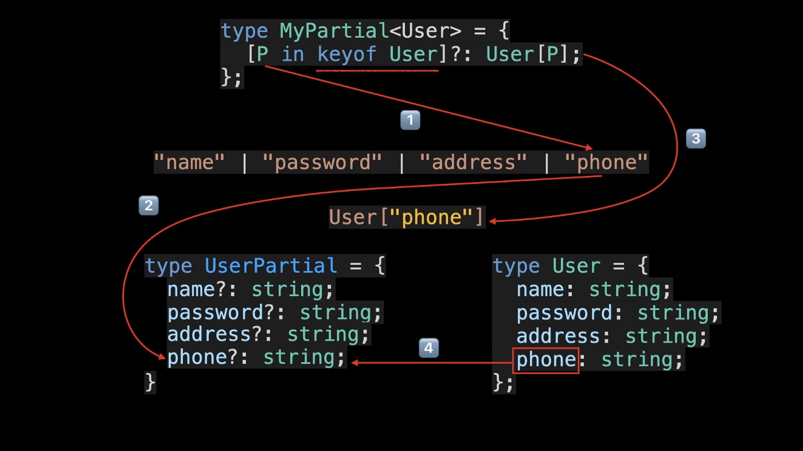

```typescript
// Remove the 'kind' property
type RemoveKindField<T> = {
  [K in keyof T as Exclude<K, "kind">]: T[K];
};
interface Circle {
  kind: "circle";
  radius: number;
}
type KindlessCircle = RemoveKindField<Circle>;
//   type KindlessCircle = {
//       radius: number;
//   };
```


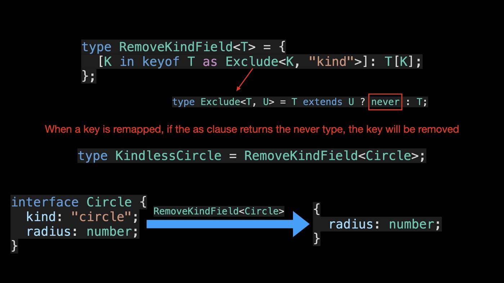

- 重新映射键（TS 4.1）
  在 TypeScript 4.1 及更高版本中，您可以使用映射类型中的 as 子句重新映射映射类型中的键：

```typescript
type MappedTypeWithNewKeys<T> = {
  [K in keyof T as NewKeyType]: T[K];
  //            ^^^^^^^^^^^^^
  //            New Syntax！
};
```

您可以利用模板文本类型等功能从以前的属性名称创建新的属性名称：

```typescript
type Getters<T> = {
  [K in keyof T as `get${Capitalize<string & K>}`]: () => T[K];
};
interface Person {
  name: string;
  age: number;
  location: string;
}
type LazyPerson = Getters<Person>;
// {
//   getName: () => string;
//   getAge: () => number;
//   getLocation: () => string;
// }
```


