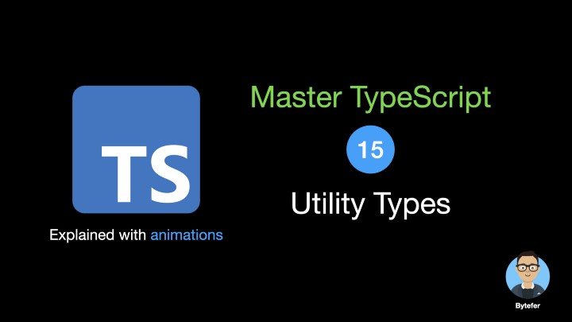
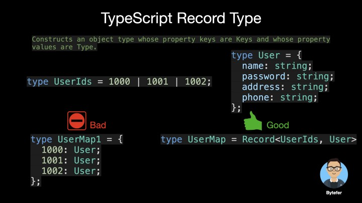
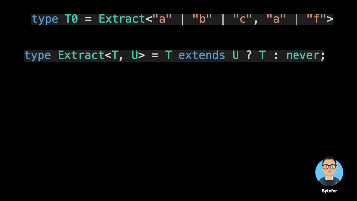
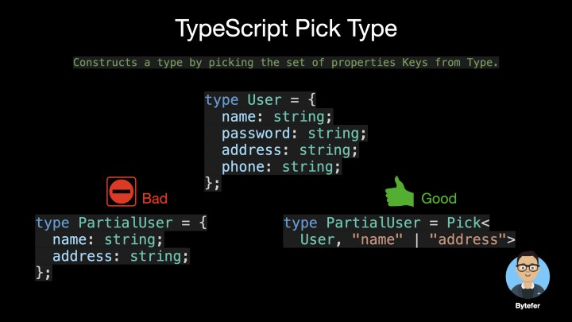
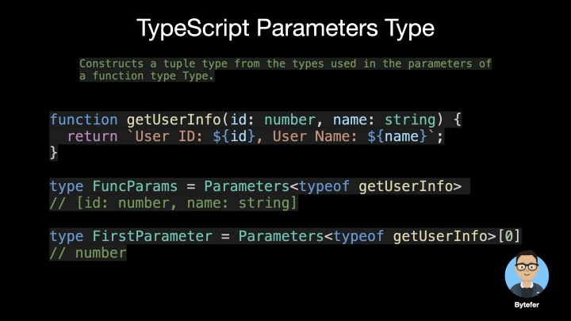
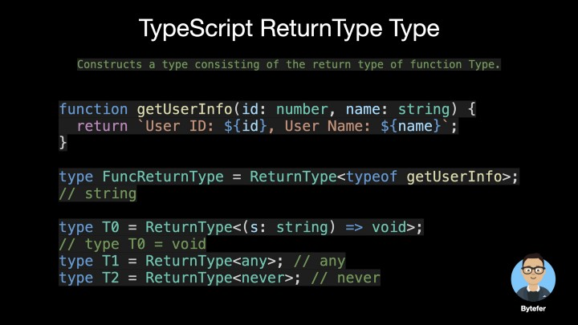
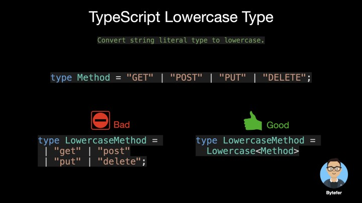
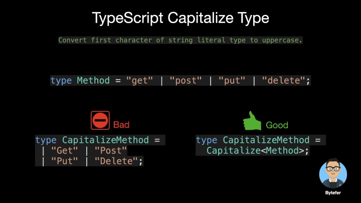

## 2.Utility Types

TypeScript 提供了几种实用程序类型来促进常见的类型转换。这些实用程序在全球范围内可用。



### 2.1 Partial &lt;Type&gt;

- 作用
  构造一个类型，让所有的类型设置为可选


- 用法


- 源码实现

```typescript
/**
 * Make all properties in T optional.
 * typescript/lib/lib.es5.d.ts
 */
type Partial<T> = {
  [P in keyof T]?: T[P];
};
```

### 2.2 Required&lt;Type&gt;

- 作用
  构造一个类，将所有属性设为必需，与 paritial 相反


- 用法


- 源码

```typescript
/**
 * Make all properties in T required.
 * typescript/lib/lib.es5.d.ts
 */
type Required<T> = {
  [P in keyof T]-?: T[P];
};
```

### 2.3 Readonly&lt;Type&gt;

- 作用
  构造一个类型，将属性设置为可读，这就意味着构造类型的属性不能重新分配。


- 用法

  

  

- 源码

```typescript
/**
 * Make all properties in T readonly.
 * typescript/lib/lib.es5.d.ts
 */
type Readonly<T> = {
  readonly [P in keyof T]: T[P];
};
```

### 2.4 Record&lt;Type&gt;

- 作用
  构造一个对象类型，其属性键为 Keys，其属性值为 Type。此实用程序可用于将一种类型的属性映射到另一种类型。

  

- 源码

```typescript
/**
 * Construct a type with a set of properties K of type T.
 * typescript/lib/lib.es5.d.ts
 */
type Record<K extends keyof any, T> = {
  [P in K]: T;
};
```

### 2.5 Exclude&lt;UnionType, ExcludedMembers&gt;

- 作用
  通过从 UnionType 中排除可分配给 ExcludedMembers 的所有联合成员来构造类型。

  

- 用法

  

  

- 源码

```typescript
/**
 * Exclude from T those types that are assignable to U.
 * typescript/lib/lib.es5.d.ts
 */
type Exclude<T, U> = T extends U ? never : T;
```

### 2.6 Extrac&lt;Type,Union&gt;

- 作用
  通过从 Type 中提取所有可分配给 Union 的联合成员来构造一个类型。与 exclude 相反。取交集

  

- 用法

  

  

- 源码

```typescript
/**
 * Extract from T those types that are assignable to U.
 * typescript/lib/lib.es5.d.ts
 */
type Extract<T, U> = T extends U ? T : never;
```

### 2.7 Pick&lt;Type,Keys&gt;

- 作用
  通过从 Type 中选择一组属性 Keys（字符串文字或字符串文字的联合）来构造一个类型。

  

- 用法

  

  

- 源码

```typescript
/**
 * From T, pick a set of properties whose keys are in the union K.
 * typescript/lib/lib.es5.d.ts
 */
type Pick<T, K extends keyof T> = {
  [P in K]: T[P];
};
```

### 2.8 Omit&lt;Type,Keys&gt;

- 作用
  通过从 Type 中选择所有属性然后删除 Keys（字符串文字或字符串文字的联合）来构造一个类型。与 Pick 相反

  

- 用法
  

  

- 源码

```typescript
/**
 * Construct a type with the properties of T except for those
 * in type K.
 * typescript/lib/lib.es5.d.ts
 */
type Omit<T, K extends keyof any> = Pick<T, Exclude<keyof T, K>>;
```

### 2.9 NonNullable&lt;Type&gt;

- 作用
  通过从 Type 中排除 null 和 undefined 来构造一个类型。

  

- 源码

```typescript
/**
 * Exclude null and undefined from T.
 * typescript/lib/lib.es5.d.ts
 */
type NonNullable<T> = T extends null | undefined ? never : T;
```

### 2.10 Parameters&lt;Type&gt;

- 作用
  从函数类型的参数中使用的类型构造元组类型

  

- 源码

```typescript
/**
 * Obtain the parameters of a function type in a tuple.
 * typescript/lib/lib.es5.d.ts
 */
type Parameters<T extends (...args: any) => any> = T extends (
  ...args: infer P
) => any
  ? P
  : never;
```

### 2.11 ReturnType&lt;Type&gt;

- 作用
  构造一个由函数 Type 的返回类型组成的类型。

  

- 源码

```typescript
/**
 * Obtain the return type of a function type.
 * typescript/lib/lib.es5.d.ts
 */
type ReturnType<T extends (...args: any) => any> = T extends (
  ...args: any
) => infer R
  ? R
  : any;
```

### 2.12 Uppercase&lt;StringType&gt;

- 作用
  将字符串文字类型转换为大写

  

### 2.13 Lowercase&lt;StringType&gt;

- 作用
  将字符串文字类型转换为小写。

  

### 2.14 Capitalize&lt;StringType&gt;

- 作用
  将字符串文字类型的第一个字符转换为大写。

  

### 2.15 Uncapitalize&lt;StringType&gt;

- 作用
  将字符串文字类型的第一个字符转换为小写

  

### 参考文献

- [ TypeScript Visualized: 15 Most Used Utility Types](https://javascript.plainenglish.io/15-utility-types-that-every-typescript-developer-should-know-6cf121d4047c)

- [ https://www.typescriptlang.org/docs/handbook/utility-types.html](https://www.typescriptlang.org/docs/handbook/utility-types.html)
