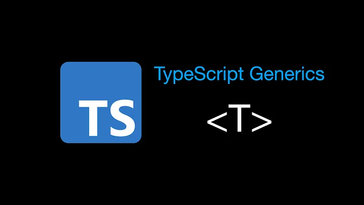
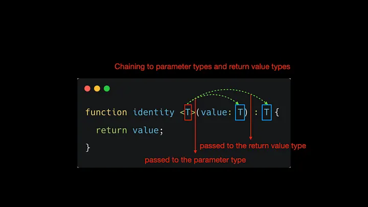
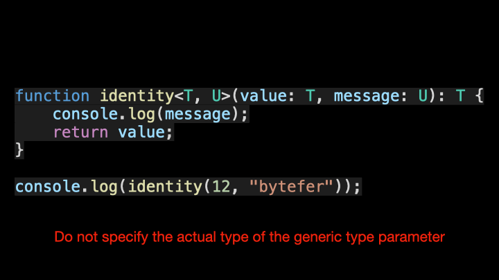

<!--
 * @Author: maxueming maxueming@kuaishou.com
 * @Date: 2023-08-16 17:23:25
 * @LastEditors: maxueming maxueming@kuaishou.com
 * @LastEditTime: 2023-08-16 18:19:49
 * @FilePath: /You-Don-t-Know-TS/vuepress/docs/theme-reco/article-1-en.md
 * @Description: 这是默认设置,请设置`customMade`, 打开koroFileHeader查看配置 进行设置: https://github.com/OBKoro1/koro1FileHeader/wiki/%E9%85%8D%E7%BD%AE
-->

# What Are K, T, and V in TypeScript Generics?

Welcome to the Mastering TypeScript series. This series will introduce the core knowledge and techniques of TypeScript in the form of animations. Let’s learn together! Previous articles are as follows:

[简体中文](./article-1.md)

- [What Are K, T, and V in TypeScript Generics?](article-1-en.md)
- [Using TypeScript Mapped Types Like a Pro](article-1-en.md)
- [Using TypeScript Conditional Types Like a Pro](article-1-en.md)
- [Using TypeScript Intersection Types Like a Pro](article-1-en.md)
- [Using TypeScript infer Like a Prov](article-1-en.md)
- [Using TypeScript Template Literal Types Like a Prov](article-1-en.md)
- [TypeScript Visualized: 15 Most Used Utility Types](./Advanced-2.md)
- [10 Things You Need To Know About TypeScript Classes](article-1-en.md)
- [The Purpose of ‘declare’ Keyword in TypeScript](article-1-en.md)
- [How To Define Objects Type With Unknown Structures in TypeScript](article-1-en.md)

Does it sound strange when you first see the `T` in TypeScript generics?

The `T` in the figure is called a generic type parameter, and it is the type placeholder we wish to pass to the identity function.

Just like passing parameters, we take the actual type specified by the user and chain it to the parameter type and the return value type.

So what does `T` mean? The generic type parameter `T` in the figure represents Type, in fact, `T` can be replaced by any valid name. In addition to `T`, common generic variables are` K`, `V`, `E`, etc.

- K(Key): represents the type of key in the object
- V(Value): represents the type of value in the object
- E(Element): represents the element type

Of course, you don’t have to define only one type parameter, you can introduce any number of type parameters. Here we introduce a new type parameter `U` that extends the identity function we defined.

When calling the identity function, we can explicitly specify the actual type of the generic parameter. Of course, you can also not specify the type of the generic parameter, and let TypeScript automatically complete the type inference for us.

After watching the above animation, do you already understand generic type parameters?

If you like to learn TypeScript in the form of animation, you can follow me on Medium or Twitter to read more about TS and JS!
