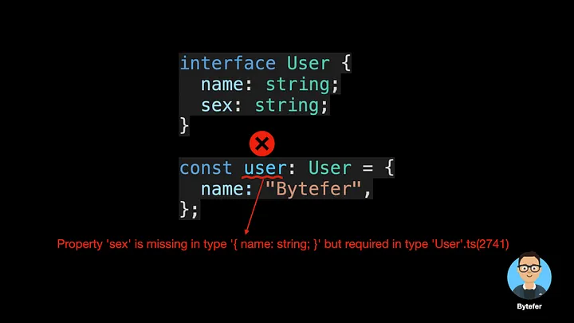
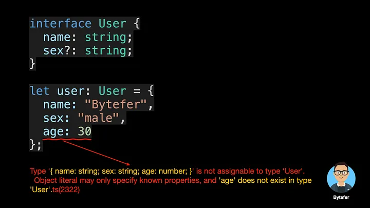
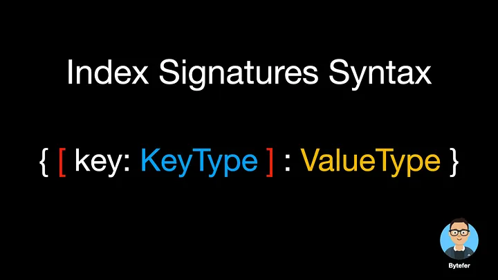
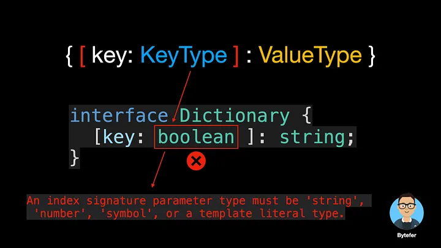
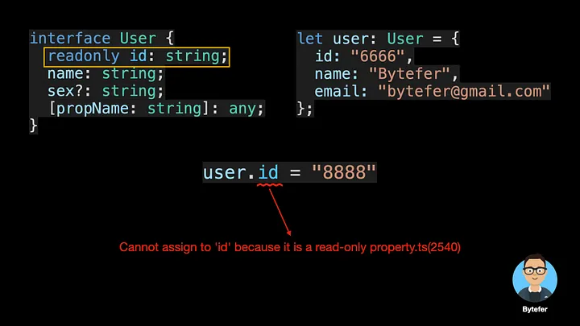
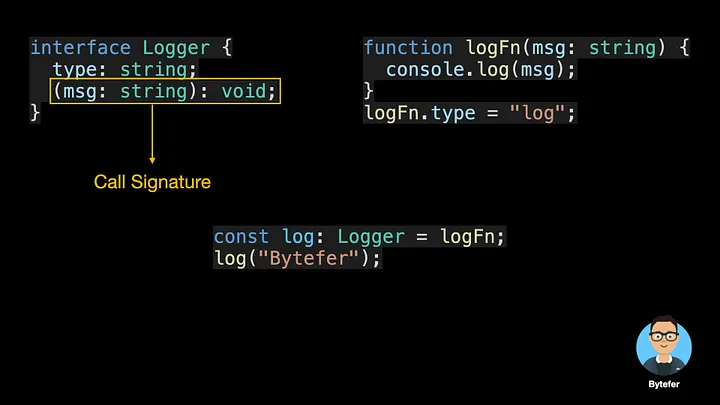

<!--
 * @Author: maxueming maxueming@kuaishou.com
 * @Date: 2023-09-27 15:08:00
 * @LastEditors: maxueming maxueming@kuaishou.com
 * @LastEditTime: 2023-09-27 15:42:08
 * @FilePath: /You-Don-t-Know-TS/vuepress/docs/theme-reco/article-10-en.md
 * @Description: 这是默认设置,请设置`customMade`, 打开koroFileHeader查看配置 进行设置: https://github.com/OBKoro1/koro1FileHeader/wiki/%E9%85%8D%E7%BD%AE
-->

# 10 Things You Need To Know About TypeScript Interface

10 usage scenarios of TypeScript interfaces — maybe only 20% of web developers master them all


Welcome to the Mastering TypeScript series. This series will introduce the core knowledge and techniques of TypeScript in the form of animations. Let’s learn together! Previous articles are as follows:

[简体中文](./article-10.md)

- [What Are K, T, and V in TypeScript Generics?](article-1-en.md)
- [Using TypeScript Mapped Types Like a Pro](article-1-en.md)
- [Using TypeScript Conditional Types Like a Pro](article-1-en.md)
- [Using TypeScript Intersection Types Like a Pro](article-1-en.md)
- [Using TypeScript infer Like a Prov](article-1-en.md)
- [Using TypeScript Template Literal Types Like a Prov](article-1-en.md)
- [TypeScript Visualized: 15 Most Used Utility Types](./Advanced-2.md)
- [10 Things You Need To Know About TypeScript Classes](article-1-en.md)
- [The Purpose of ‘declare’ Keyword in TypeScript](article-1-en.md)
- [How To Define Objects Type With Unknown Structures in TypeScript](article-1-en.md)
  The interface in TypeScript is a very flexible concept. In addition to abstracting part of the behavior of a class, it is also often used to describe the “shape of an object”.

### Required Properties

When defining an interface, you need to use the interface keyword:

```typescript
interface User {
  name: string;
  sex: string;
}
const user: User = {
  name: "Bytefer",
  sex: "male",
};
```

In the above code, we have defined a User interface. Then define a user variable and set its type to User type. But if we assign a value to the user variable, the relevant property is missing. Then the TypeScript compiler will prompt related errors. For example, in the following code, we are missing the sex property when assigning:



So how to solve the above error? One of the solutions is to use ? to declare that some properties are optional when defining the interface.

### Optional Properties

```typescript
interface User {
  name: string;
  sex?: string;
}
let user: User = {
  // OK
  name: "Bytefer",
};
user = {
  // Ok
  name: "Bytefer",
  sex: "male",
};
```

Since missing properties are not allowed, is it OK to add undeclared properties?



As can be seen from the above figure, when using the object literal assignment, including the undeclared age property, an error will also occur. The easiest way to fix this is to add an age property to the User type:

```typescript
interface User {
  name: string;
  sex?: string;
  age: number;
}
```

Although this solution can solve the problem, if we want to add other arbitrary properties, this way is not very good. To meet the above requirements, we can use the index signatures.

### Index Signatures

The syntax of the index signatures is as follows:



The type of the key can only be string, number, symbol, or template literal type, while the type of the value can be any type.



Now that we understand the syntax of index signatures, let’s update the User type:

```typescript
interface User {
  name: string;
  sex?: string;
  [propName: string]: any; // Index Signatures
}
```

After updating the User type, and adding the new age and email properties, the TypeScript compiler will not prompt an error.

```typescript
let user: User = {
  name: "Bytefer",
  sex: "male",
  age: 30,
  email: "bytefer@gmail.com",
};
```

### Readonly Properties

In the web system, we need to distinguish different users, in general, we will use a id property to identify different users. This property is automatically generated by the Web system and cannot be modified by the user. For the above scenario, we can use the readonly modifier to define read-only properties.



In addition to properties, objects may also contain methods. When using an interface to define an object type, we can also declare the methods that exist on the object at the same time:

```ts
interface User {
  id: string;
  name: string;
  say(words: string): void;
}
let user: User = {
  id: "6666",
  name: "Bytefer",
  say(words: string) {
    console.log(words);
  },
};
```

### Call Signatures

The simplest way to describe a function is with a function type expression. These types are syntactically similar to arrow functions:

```ts
const log: (msg: string) => void = (msg: string) => {
  console.log(msg);
};
log("Bytefer");
```

The syntax (msg: string) => void means “a function with one parameter, named msg, of type string, that doesn’t have a return value”. Of course, we can use a type alias to name a function type:

```ts
type LogFn = (msg: string) => void;
const log: LogFn = (msg: string) => {
  console.log(msg);
};
```

The function itself is also an object if we want to describe something callable with properties. Then the function type expression cannot meet this requirement. For this scenario, we can use the call signature when defining the object type:



It should be noted that when declaring the call signature, overloading is also supported:

```ts
interface Logger {
  type: string;
  (msg: string): void;
  (msg: string, timestamp: number): void;
  (msg: string, timestamp: number, module: string): void;
}
```

If you don’t know about function overloads, you can read the following article:

[What are Function Overloads in TypeScript?](./article-8.md)

### Construct Signatures

In addition to calling functions directly, we can also use the new operator to call functions, which are generally called constructors. We can write a construct signature by adding the new keyword in front of a call signature:

```ts
interface PointConstructor {
  new (x: number, y: number): { x: number; y: number };
}
function createPoint(ctor: PointConstructor, x: number = 0, y: number = 0) {
  return new ctor(x, y);
}
class Point {
  constructor(public x: number, public y: number) {}
}
const zero = createPoint(Point);
console.log(zero);
```

### Hybrid Types

So when defining an interface, can we use both the call signatures and the construct signatures at the same time? The answer is yes, our commonly used Date object, and its type is DateConstructor, in which both call signatures and construct signatures are used:

```ts
declare var Date: DateConstructor;
```

In the above code, in addition to the call signatures and construct signatures, the properties and methods on the Date constructor are also defined.

### Generic Interface

The generic type can also be used with the interface. The following is a generic interface.

```ts
interface KeyPair<T, U> {
  key: T;
  value: U;
}
let kv1: KeyPair<number, string> = { key: 1, value: "Bytefer" };
```

T and U in the above code are type parameters, if you want to know more about them, you can read the following article:

[What Are K, T, and V in TypeScript Generics?](./article-1.md)

### Extends Interface

Interfaces can extend one or more interfaces. This makes writing interfaces flexible and reusable.

```ts
interface Point1D {
  x: number;
}
interface Point2D extends Point1D {
  y: number;
}
interface Point3D extends Point2D {
  z: number;
}
const point1D = { x: 0 };
const point2D = { x: 0, y: 0 };
const point3D = { x: 0, y: 0, z: 0 };
```

In addition to extending a single interface, TypeScript also allows us to extend multiple interfaces:

```ts
interface CanSay {
  say(words: string): void;
}
interface CanWalk {
  walk(): void;
}
interface Human extends CanSay, CanWalk {
  name: string;
}
```

### Extends Class

When declaring an interface, we can extend one or more interfaces. In fact, we can also extend a declared class:

```ts
class Point1D {
  public x!: number;
}
interface Point2D extends Point1D {
  y: number;
}
const point2D: Point2D = { x: 0, y: 0 };
```

For a class, when declaring the class, it can implement multiple interfaces at the same time:

```ts
interface CanSay {
  say(words: string): void;
}
interface CanWalk {
  walk(): void;
}
class Person implements CanSay, CanWalk {
  constructor(public name: string) {}
  public say(words: string): void {
    console.log(`${this.name} says：${words}`);
  }
  public walk(): void {
    console.log(`${this.name} walk with feet`);
  }
}
```

For TypeScript developers, interface and type have many similarities, and of course, there are some differences. If you want to understand the difference between them, I recommend you to read the following article:

[No More Confusion About TypeScript’s Type and Interface](./article-4.md)

If you like to learn TypeScript, you can follow me on Medium or Twitter to read more about TS and JS!
