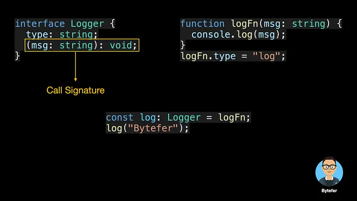

<!--
 * @Author: maxueming maxueming@kuaishou.com
 * @Date: 2023-09-27 15:08:00
 * @LastEditors: maxueming maxueming@kuaishou.com
 * @LastEditTime: 2023-09-27 16:36:39
 * @FilePath: /You-Don-t-Know-TS/vuepress/docs/theme-reco/article-10-en.md
 * @Description: 这是默认设置,请设置`customMade`, 打开koroFileHeader查看配置 进行设置: https://github.com/OBKoro1/koro1FileHeader/wiki/%E9%85%8D%E7%BD%AE
-->

# 关于 TypeScript 接口你需要了解的 10 件事

10 usage scenarios of TypeScript interfaces — maybe only 20% of web developers master them all


Welcome to the Mastering TypeScript series. This series will introduce the core knowledge and techniques of TypeScript in the form of animations. Let’s learn together! Previous articles are as follows:

[English](./article-10-en.md)

- [What Are K, T, and V in TypeScript Generics?](article-1-en.md)
- [Using TypeScript Mapped Types Like a Pro](article-1-en.md)
- [Using TypeScript Conditional Types Like a Pro](article-1-en.md)
- [Using TypeScript Intersection Types Like a Pro](article-1-en.md)
- [Using TypeScript infer Like a Prov](article-1-en.md)
- [Using TypeScript Template Literal Types Like a Prov](article-1-en.md)
- [TypeScript Visualized: 15 Most Used Utility Types](./Advanced-2.md)
- [10 Things You Need To Know About TypeScript Classes](article-1-en.md)
- [The Purpose of ‘declare’ Keyword in TypeScript](article-1-en.md)
- [How To Define Objects Type With Unknown Structures in TypeScript](article-1-en.md)
- TypeScript 中的接口是一个非常灵活的概念。除了抽象类的部分行为外，它还经常被用来描述“对象的形状”。

### 所需属性

定义接口时，需要使用 interface 关键字：

```typescript
interface User {
  name: string;
  sex: string;
}
const user: User = {
  name: "Bytefer",
  sex: "male",
};
```

在上面的代码中，我们定义了一个用户界面。然后定义一个用户变量并将其类型设置为用户类型。但如果我们给用户变量赋值，相关属性就会丢失。然后 TypeScript 编译器会提示相关错误。例如，在下面的代码中，我们在分配时缺少性别属性：


那么如何解决上述错误呢？解决方案之一是使用 ?在定义接口时声明某些属性是可选的。

### 可选属性

```typescript
interface User {
  name: string;
  sex?: string;
}
let user: User = {
  // OK
  name: "Bytefer",
};
user = {
  // Ok
  name: "Bytefer",
  sex: "male",
};
```

既然不允许缺少属性，那么添加未声明的属性是否可以？


从上图可以看出，使用对象字面量赋值时，包括未声明的 age 属性，也会出现错误。解决此问题的最简单方法是将年龄属性添加到 User 类型：

```typescript
interface User {
  name: string;
  sex?: string;
  age: number;
}
```

虽然这种方案可以解决问题，但是如果我们想添加其他任意属性，这种方式就不太好了。为了满足上述要求，我们可以使用索引签名。

### 索引签名

索引签名的语法如下:


键的类型只能是字符串、数字、符号或模板文字类型，而值的类型可以是任意类型。


现在我们了解了索引签名的语法，让我们更新 User 类型：

```typescript
interface User {
  name: string;
  sex?: string;
  [propName: string]: any; // Index Signatures
}
```

更新用户类型并添加新的年龄和电子邮件属性后，TypeScript 编译器将不会提示错误。

```typescript
let user: User = {
  name: "Bytefer",
  sex: "male",
  age: 30,
  email: "bytefer@gmail.com",
};
```

### 只读属性

在 web 系统中，我们需要区分不同的用户，一般情况下，我们会使用一个 id 属性来标识不同的用户。该属性由 Web 系统自动生成，用户无法修改。对于上面的场景，我们可以使用 readonly 修饰符来定义只读属性。


除了属性之外，对象还可以包含方法。当使用接口定义对象类型时，我们还可以同时声明该对象上存在的方法：

```ts
interface User {
  id: string;
  name: string;
  say(words: string): void;
}
let user: User = {
  id: "6666",
  name: "Bytefer",
  say(words: string) {
    console.log(words);
  },
};
```

### 呼叫签名

描述函数的最简单方法是使用函数类型表达式。这些类型在语法上类似于箭头函数：

```ts
const log: (msg: string) => void = (msg: string) => {
  console.log(msg);
};
log("Bytefer");
```

语法 (msg: string) => void 表示“一个带有一个参数、名为 msg、字符串类型、没有返回值的函数”。当然，我们可以使用类型别名来命名函数类型：

```ts
type LogFn = (msg: string) => void;
const log: LogFn = (msg: string) => {
  console.log(msg);
};
```

如果我们想用属性来描述可调用的东西，函数本身也是一个对象。那么函数类型表达式就无法满足这个要求。对于这种场景，我们可以在定义对象类型时使用调用签名：



需要注意的是，声明调用签名时，也支持重载：

```ts
interface Logger {
  type: string;
  (msg: string): void;
  (msg: string, timestamp: number): void;
  (msg: string, timestamp: number, module: string): void;
}
```

如果你不了解函数重载，可以阅读下面的文章：

[What are Function Overloads in TypeScript?](./article-8.md)

### 构建签名

除了直接调用函数外，我们还可以使用 new 运算符来调用函数，一般称为构造函数。我们可以通过在调用签名前面添加 new 关键字来编写构造签名：

```ts
interface PointConstructor {
  new (x: number, y: number): { x: number; y: number };
}
function createPoint(ctor: PointConstructor, x: number = 0, y: number = 0) {
  return new ctor(x, y);
}
class Point {
  constructor(public x: number, public y: number) {}
}
const zero = createPoint(Point);
console.log(zero);
```

### 混合类型

那么在定义接口时，我们可以同时使用调用签名和构造签名吗？答案是肯定的，我们常用的 Date 对象，它的类型是 DateConstructor，其中同时使用了调用签名和构造签名：

```ts
declare var Date: DateConstructor;
```

在上面的代码中，除了调用签名和构造签名之外，还定义了 Date 构造函数上的属性和方法。

### 泛型接口

泛型类型也可以与接口一起使用。以下是通用接口。

```ts
interface KeyPair<T, U> {
  key: T;
  value: U;
}
let kv1: KeyPair<number, string> = { key: 1, value: "Bytefer" };
```

上面代码中的 T 和 U 是类型参数，如果你想了解更多，可以阅读下面的文章：

[What Are K, T, and V in TypeScript Generics?](./article-1.md)

### 扩展类型

接口可以扩展一个或多个接口。这使得编写接口变得灵活且可重用。

```ts
interface Point1D {
  x: number;
}
interface Point2D extends Point1D {
  y: number;
}
interface Point3D extends Point2D {
  z: number;
}
const point1D = { x: 0 };
const point2D = { x: 0, y: 0 };
const point3D = { x: 0, y: 0, z: 0 };
```

除了扩展单个接口之外，TypeScript 还允许我们扩展多个接口：

```ts
interface CanSay {
  say(words: string): void;
}
interface CanWalk {
  walk(): void;
}
interface Human extends CanSay, CanWalk {
  name: string;
}
```

### 扩展类

对于一个类来说，声明该类时，可以同时实现多个接口：

```ts
class Point1D {
  public x!: number;
}
interface Point2D extends Point1D {
  y: number;
}
const point2D: Point2D = { x: 0, y: 0 };
```

对于一个类来说，声明该类时，可以同时实现多个接口：

```ts
interface CanSay {
  say(words: string): void;
}
interface CanWalk {
  walk(): void;
}
class Person implements CanSay, CanWalk {
  constructor(public name: string) {}
  public say(words: string): void {
    console.log(`${this.name} says：${words}`);
  }
  public walk(): void {
    console.log(`${this.name} walk with feet`);
  }
}
```

对于 TypeScript 开发者来说，接口和类型有很多相似之处，当然也有一些不同之处。如果您想了解它们之间的区别，建议您阅读以下文章：

[No More Confusion About TypeScript’s Type and Interface](./article-4.md)

If you like to learn TypeScript, you can follow me on Medium or Twitter to read more about TS and JS!
