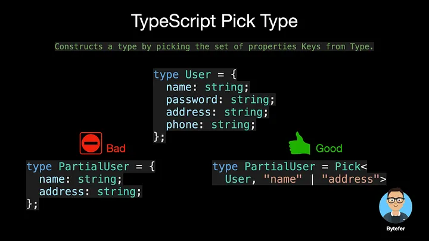

<!--
 * @Author: maxueming maxueming@kuaishou.com
 * @Date: 2023-08-16 17:17:46
 * @LastEditors: maxueming maxueming@kuaishou.com
 * @LastEditTime: 2023-08-16 18:19:58
 * @FilePath: /You-Don-t-Know-TS/vuepress/docs/theme-reco/article-2-en.md
 * @Description: 这是默认设置,请设置`customMade`, 打开koroFileHeader查看配置 进行设置: https://github.com/OBKoro1/koro1FileHeader/wiki/%E9%85%8D%E7%BD%AE
-->

# Easily Understand TypeScript Generic Utility Types


Welcome to the Mastering TypeScript series. This series will introduce the core knowledge and techniques of TypeScript in the form of animations. Let’s learn together! Previous articles are as follows:

[简体中文](./article-2.md)

- [What Are K, T, and V in TypeScript Generics?](article-1-en.md)
- [Using TypeScript Mapped Types Like a Pro](article-1-en.md)
- [Using TypeScript Conditional Types Like a Pro](article-1-en.md)
- [Using TypeScript Intersection Types Like a Pro](article-1-en.md)
- [Using TypeScript infer Like a Prov](article-1-en.md)
- [Using TypeScript Template Literal Types Like a Prov](article-1-en.md)
- [TypeScript Visualized: 15 Most Used Utility Types](./Advanced-2.md)
- [10 Things You Need To Know About TypeScript Classes](article-1-en.md)
- [The Purpose of ‘declare’ Keyword in TypeScript](article-1-en.md)
- [How To Define Objects Type With Unknown Structures in TypeScript](article-1-en.md)

If you are new to TypeScript, when you read articles on the usage and internal implementation of TypeScript’s built-in utility types, you may see the Pick utility type, and you may be unfamiliar with the syntax of this type.



```typescript
/**
 * From T, pick a set of properties whose keys are in the union K.
 * typescript/lib/lib.es5.d.ts
 */
type Pick<T, K extends keyof T> = {
  [P in K]: T[P];
};
```

One of the better ways to learn new things is to use analogies. Next, I’ll help you quickly understand the syntax behind the Pick utility type with the help of functions in JavaScript.


In the above code, function is the keyword used to declare JavaScript function, Pickis the function name, obj and keys in parentheses are parameters, and the function body is defined in curly brackets.


For the Pick utility type, the type keyword is used to give an alias to the type, which is convenient for repeated use. Pick is the name of the type. The T and K inside the angle brackets are type parameters. **The difference from the parameters in JavaScript functions is that type parameters store types, while JavaScript function parameters store values.**


where K extends keyof T is the syntax for generic constraints, used to constrain the scope of a type. Inside the curly braces is the concrete implementation of the utility type, which uses the syntax of TypeScript mapped types.

**You can actually think of TypeScript’s built-in utility types as special functions that are used to handle the types that exist in TypeScript.** The difference between calling a utility type and calling a JavaScript function is the use of angle brackets.

In order to make it easier for everyone to understand, I will demonstrate the execution process of the Pick utility type in the form of animation.


If you’re new to TypeScript, I hope that after reading this article you’ll have a better understanding of TypeScript’s built-in utility types. The Pick utility type introduced in the article uses TypeScript’s mapped type internally. If you are new to TypeScript mapped types, I recommend reading the following article.

- [Using TypeScript Mapped Types Like a Pro](article-1-en.md)

If you want to learn other very useful built-in utility types for TypeScript, the related articles are also ready for you.

- [TypeScript Visualized: 15 Most Used Utility Types](./Advanced-2.md)
