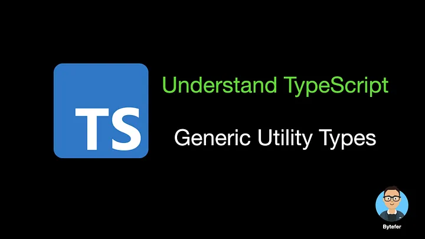
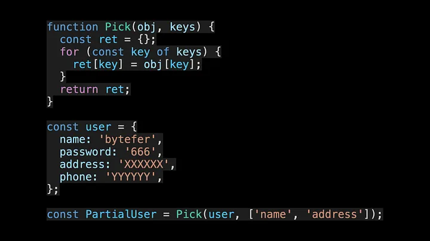
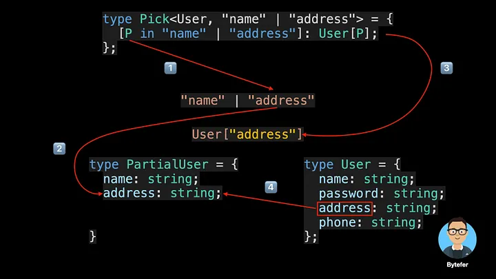

<!--
 * @Author: maxueming maxueming@kuaishou.com
 * @Date: 2023-08-16 17:17:35
 * @LastEditors: maxueming maxueming@kuaishou.com
 * @LastEditTime: 2023-08-16 18:38:46
 * @FilePath: /You-Don-t-Know-TS/vuepress/docs/theme-reco/article-2.md
 * @Description: 这是默认设置,请设置`customMade`, 打开koroFileHeader查看配置 进行设置: https://github.com/OBKoro1/koro1FileHeader/wiki/%E9%85%8D%E7%BD%AE
-->

# 轻松理解 TypeScript 通用实用程序类型


欢迎来到掌握 TypeScript 系列。本系列将以动画的形式介绍 TypeScript 的核心知识和技术。一起来学习吧！往期文章如下：

[英文版本](./article-2-en.md)

- [What Are K, T, and V in TypeScript Generics?](article-1.md)
- [Using TypeScript Mapped Types Like a Pro](article-1.md)
- [Using TypeScript Conditional Types Like a Pro](article-1.md)
- [Using TypeScript Intersection Types Like a Pro](article-1.md)
- [Using TypeScript infer Like a Prov](article-1.md)
- [Using TypeScript Template Literal Types Like a Prov](article-1.md)
- [TypeScript Visualized: 15 Most Used Utility Types](./Advanced-2.md)
- [10 Things You Need To Know About TypeScript Classes](article-1.md)
- [The Purpose of ‘declare’ Keyword in TypeScript](article-1.md)
- [How To Define Objects Type With Unknown Structures in TypeScript](article-1.md)

如果你是 TypeScript 新手，当你阅读有关 TypeScript 内置实用程序类型的用法和内部实现的文章时，你可能会看到 `Pick` 实用程序类型，并且你可能不熟悉该类型的语法。


```typescript
/**
 * From T, pick a set of properties whose keys are in the union K.
 * typescript/lib/lib.es5.d.ts
 */
type Pick<T, K extends keyof T> = {
  [P in K]: T[P];
};
```

学习新事物的更好方法之一是使用类比。接下来，我将借助 JavaScript 中的函数帮助您快速理解 Pick 实用程序类型背后的语法。



上面的代码中，function 是用于声明 JavaScript 函数的关键字，Pick 是函数名，括号中的 obj 和 key 是参数，函数体是在大括号中定义的。


对于 Pick 实用程序类型，使用 type 关键字为类型赋予别名，方便重复使用。 Pick 是类型的名称。尖括号内的 T 和 K 是类型参数。**与 JavaScript 函数中的参数不同的是，类型参数存储类型，而 JavaScript 函数参数存储值。**


其中 K extends keyof T 是通用约束的语法，用于约束类型的范围。大括号内是实用程序类型的具体实现，它使用 TypeScript 映射类型的语法。

**实际上，您可以将 TypeScript 的内置实用程序类型视为用于处理 TypeScript 中存在的类型的特殊函数**调用实用程序类型和调用 JavaScript 函数之间的区别在于尖括号的使用。

为了让大家更容易理解，我将以动画的形式演示 Pick 实用程序类型的执行过程




如果您是 TypeScript 的新手，我希望读完本文后您能够更好地了解 TypeScript 的内置实用程序类型。**本文中介绍的 Pick 实用程序类型在内部使用 TypeScript 的映射类型。**如果您不熟悉 TypeScript 映射类型，我建议您阅读以下文章。

- [Using TypeScript Mapped Types Like a Pro](article-1-en.md)

如果您想了解 TypeScript 其他非常有用的内置实用程序类型，相关文章也已经为您准备好了。

- [TypeScript Visualized: 15 Most Used Utility Types](./Advanced-2.md)
