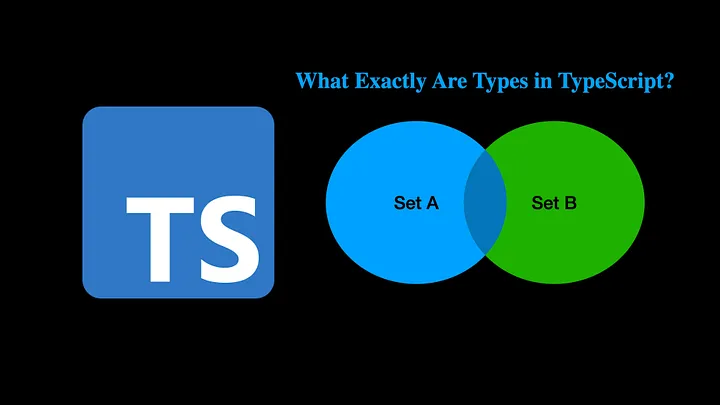
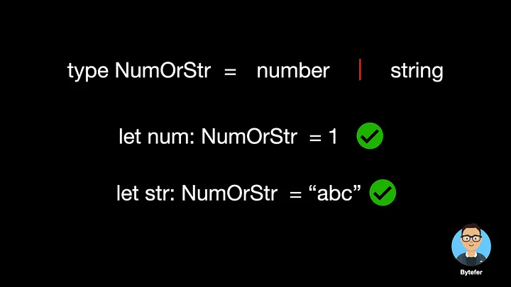
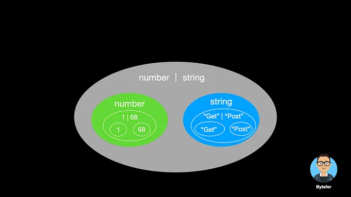

<!--
 * @Author: maxueming maxueming@kuaishou.com
 * @Date: 2023-08-16 18:15:51
 * @LastEditors: maxueming maxueming@kuaishou.com
 * @LastEditTime: 2023-08-16 18:27:26
 * @FilePath: /You-Don-t-Know-TS/vuepress/docs/theme-reco/article-3-en.md
 * @Description: 这是默认设置,请设置`customMade`, 打开koroFileHeader查看配置 进行设置: https://github.com/OBKoro1/koro1FileHeader/wiki/%E9%85%8D%E7%BD%AE
-->

# What Exactly Are Types in TypeScript?



Welcome to the Mastering TypeScript series. This series will introduce the core knowledge and techniques of TypeScript in the form of animations. Let’s learn together! Previous articles are as follows:

[简体中文](./article-3.md)

- [What Are K, T, and V in TypeScript Generics?](article-1-en.md)
- [Using TypeScript Mapped Types Like a Pro](article-1-en.md)
- [Using TypeScript Conditional Types Like a Pro](article-1-en.md)
- [Using TypeScript Intersection Types Like a Pro](article-1-en.md)
- [Using TypeScript infer Like a Prov](article-1-en.md)
- [Using TypeScript Template Literal Types Like a Prov](article-1-en.md)
- [TypeScript Visualized: 15 Most Used Utility Types](./Advanced-2.md)
- [10 Things You Need To Know About TypeScript Classes](article-1-en.md)
- [The Purpose of ‘declare’ Keyword in TypeScript](article-1-en.md)
- [How To Define Objects Type With Unknown Structures in TypeScript](article-1-en.md)

TypeScript is JavaScript with syntax for types. It is a strongly typed programming language that builds on JavaScript. TypeScript has built-in common primitive data types such as string, number, boolean, bigint, and symbol.

Based on these types, we can explicitly declare the type of the variable when declaring the variable.

```typescript
let name: string = "Bytefer";
```

So what exactly are types in TypeScript? In fact, you can think of a type as a collection of values. For example, you can think of a number type as a set of all numbers, 1.0, 68 belong to this set, and “Bytefer” does not belong to this set, because it belongs to the string type.


The smallest set for a collection is the empty set, which does not contain any values. The corresponding type in TypeScript is the never type. Since its domain is empty, there are no values to assign to variables of type never.

```typescript
let num: never = 123; // Error
let name: never = "Bytefer"; // Error
```

The next smallest set is the set containing a single value. The corresponding type in TypeScript is the literal type, also known as the unit type.

```typescript
type Get = "Get";
type Post = "Post";
let m1: Get = "Get"; // Ok
let m2: Post = "Post"; // Ok
let m3: Get = "Post"; // Error
```

Since the collection corresponding to the Get type can only contain a “Get” value. So when assigning “Post” to a variable of type Get, an error occurs.

```typescript
Type '"Post"' is not assignable to type '"Get"'.ts(2322)
```

If we want the value of the m4 variable, i.e. it can be “Get” or “Post”. Then how should we define the type of the m4 variable? To meet this usage scenario, TypeScript introduces union types. By using the | operator, we can combine multiple literal types into a new type.

```typescript
type Method = "Get" | "Post";
let m4: Method = "Get"; // Ok
m4 = "Post"; // Ok
```

Since there is a collection of single values, is there a collection of two values? The answer is yes, the boolean type is the set containing the true and false values.

```typescript
type MyBoolean = true | false;
let completed: MyBoolean = true; // Ok
let enabled: MyBoolean = false; // Ok
```

In addition to finite sets, the string and number types we introduced earlier belong to infinite sets. By using the `|` operator, we can also combine number type and string type into a new union type.



Union type `A | B`, representing the union of two sets. The union type contains all the values ​​in set A and set B. For example `number | string`, `"Get" | "Post"`, specifically as shown in the figure below:



In addition to the primitive types introduced earlier, TypeScript allows us, developers, to define new types in the form of type or interface. Next, we use interface keyword to define a Point object type.

```typescript
interface Point {
  x: number;
  y: number;
}
```

For object types, we can also understand them as a collection of objects. For example, the Point type in the above code represents a collection of objects with x and y properties, and the types of the property values ​​are both number type. Then we continue to define a Named object type:

```typescript
interface Named {
  name: string;
}
```

The Namedtype represents a collection of objects containing the name property and the type of the property value is stringtype. To make it easier to understand, we use JavaScript expressions to describe the above rules.

In set theory, it is assumed that A and B are set, the set consisting of all elements belonging to set A and belonging to set B is called the intersection of set A and set B.

The above diagram is called a Venn diagram. It is used to show mathematical or logical connections between different sets of things and are especially suitable for expressing “rough relationships” between sets.

When we intersect a Point type and a Named type, a new type is created. The objects contained in this type belong to both the Point type and the Named type.

In TypeScript, the & operator is provided for us to implement the intersection operation on multiple types, and the resulting new type is called the intersection type.

For the intersection type, it also contains other knowledge, if you are interested, you can read the following article:

Using TypeScript Intersection Types Like a Pro
Details of what you should know about TypeScript Intersection Types — explained with animations.
javascript.plainenglish.io

After understanding types, let’s introduce the relationship between types. TypeScript has adopted a structured type system for better compatibility with JavaScript, which uses duck types.

```typescript
class Point1D {
  constructor(public x: number) {}
}
class Vector1D {
  constructor(public x: number) {}
}
const p1: Point1D = new Point1D(0); // Ok
const p2: Point1D = new Vector1D(0); // Ok
```

In addition to using class to define Point1D type, we can also use interface to define Point1D type. With the Point1D type, we can also extend the Point1D type through the extends keyword.

```typescript
interface Point1D {
  x: number;
}
interface Point2D extends Point1D {
  y: number;
}
interface Point3D extends Point2D {
  z: number;
}
```

In this type system, Point1D is called SuperType, while Point2D is called SubType. This relationship is usually drawn as a hierarchy:

From a set perspective, we can also use the Venn diagram introduced earlier to describe the relationship between them:

Now let’s make a summary. Compared with the parent type Point1D, the subtype Point2D will contain more properties, that is, the object described is more precise, so it takes up less space. Sets corresponding to Point2D subtypes are contained in sets corresponding to Point1D supertypes.

What’s the use of learning these things? Let’s see an example:

```typescript
interface Point1D {
  x: number;
}
interface Point2D extends Point1D {
  y: number;
}
type SubtypeOf<T, U> = T extends U ? true : false;
type S0 = SubtypeOf<Point2D, Point1D>; // true
type S1 = SubtypeOf<Point1D, Point1D>; // true
type S2 = SubtypeOf<Point1D, Point2D>; // false
```

In the above code, the SubtypeOf utility type uses the syntax of conditional types. It is very important, you can learn it in depth through this article:

Using TypeScript Conditional Types Like a Pro
Explained with animations. Master TypeScript Conditional Types and understand how TypeScript’s built-in Utility Types…
javascript.plainenglish.io

Understanding the types in TypeScript and the structured type system used is the key to TypeScript advancement, and it’s worth learning about. If you encounter unclear content, you can give me a message.

If you like to learn TypeScript in the form of animation, you can follow me on Medium or Twitter to read more about TS and JS!
