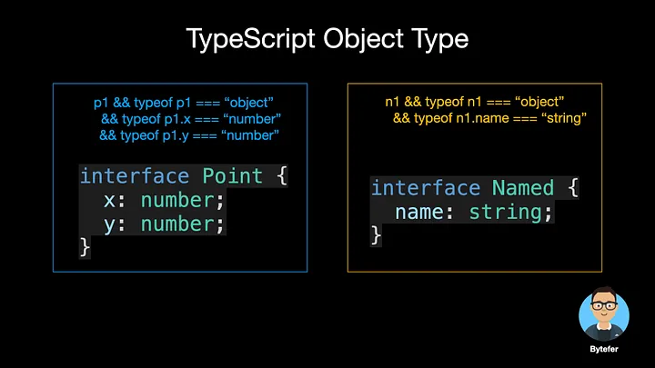
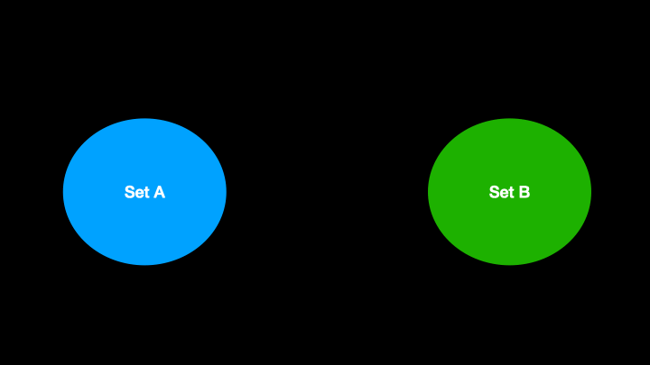
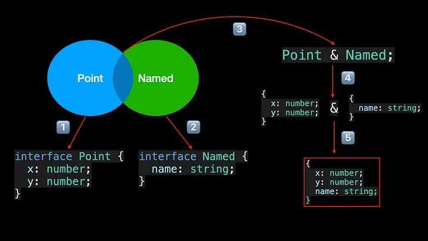
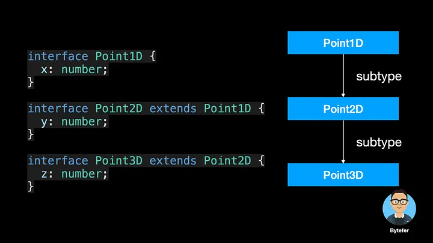
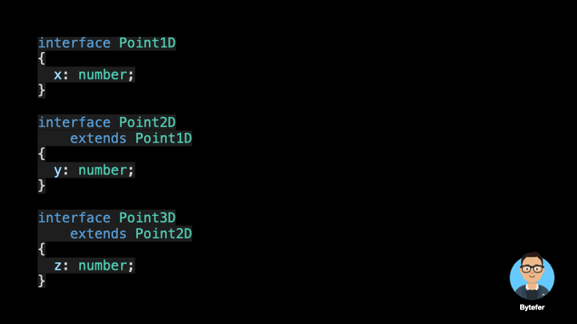

<!--
 * @Author: maxueming maxueming@kuaishou.com
 * @Date: 2023-08-16 18:15:51
 * @LastEditors: maxueming maxueming@kuaishou.com
 * @LastEditTime: 2023-08-16 18:45:28
 * @FilePath: /You-Don-t-Know-TS/vuepress/docs/theme-reco/article-3-en.md
 * @Description: 这是默认设置,请设置`customMade`, 打开koroFileHeader查看配置 进行设置: https://github.com/OBKoro1/koro1FileHeader/wiki/%E9%85%8D%E7%BD%AE
-->

# TypeScript 中的类型到底是什么？


欢迎来到掌握 TypeScript 系列。本系列将以动画的形式介绍 TypeScript 的核心知识和技术。一起来学习吧！往期文章如下：

[英文版本](./article-3.md)

- [What Are K, T, and V in TypeScript Generics?](article-1.md)
- [Using TypeScript Mapped Types Like a Pro](article-1.md)
- [Using TypeScript Conditional Types Like a Pro](article-1.md)
- [Using TypeScript Intersection Types Like a Pro](article-1.md)
- [Using TypeScript infer Like a Prov](article-1.md)
- [Using TypeScript Template Literal Types Like a Prov](article-1.md)
- [TypeScript Visualized: 15 Most Used Utility Types](./Advanced-2.md)
- [10 Things You Need To Know About TypeScript Classes](article-1.md)
- [The Purpose of ‘declare’ Keyword in TypeScript](article-1.md)
- [How To Define Objects Type With Unknown Structures in TypeScript](article-1.md)

TypeScript 是具有类型语法的 JavaScript。它是一种基于 JavaScript 构建的强类型编程语言。 TypeScript 内置了常见的基本数据类型，例如`字符串`、`数字`、`布尔值`、`bigint` 和`symbol`。

基于这些类型，我们可以在声明变量时显式声明变量的类型。

```typescript
let name: string = "Bytefer";
```

那么 TypeScript 中的类型到底是什么？事实上，您可以将类型视为值的集合。例如，你可以将数字类型视为所有数字的集合，1.0、68 属于这个集合，而“Bytefer”不属于这个集合，因为它属于字符串类型。


集合的最小集合是空集，它不包含任何值。 TypeScript 中对应的类型是 never 类型。由于它的域是空的，因此没有值可以分配给 never 类型的变量。

```typescript
let num: never = 123; // Error
let name: never = "Bytefer"; // Error
```

下一个最小的集合是包含单个值的集合。 TypeScript 中对应的类型是文字类型，也称为单元类型。

```typescript
type Get = "Get";
type Post = "Post";
let m1: Get = "Get"; // Ok
let m2: Post = "Post"; // Ok
let m3: Get = "Post"; // Error
```

由于 Get 类型对应的集合只能包含一个“Get”值。因此，当将“Post”分配给 Get 类型的变量时，会发生错误。

```typescript
Type '"Post"' is not assignable to type '"Get"'.ts(2322)
```

如果我们想要 m4 变量的值，即它可以是“Get”或“Post”。那么我们应该如何定义 m4 变量的类型呢？为了满足这种使用场景，TypeScript 引入了联合类型。通过使用 |运算符，我们可以将多个文字类型组合成一个新类型。

```typescript
type Method = "Get" | "Post";
let m4: Method = "Get"; // Ok
m4 = "Post"; // Ok
```

既然有单个值的集合，那么是否有两个值的集合？答案是肯定的，布尔类型就是包含真值和假值的集合。

```typescript
type MyBoolean = true | false;
let completed: MyBoolean = true; // Ok
let enabled: MyBoolean = false; // Ok
```

除了有限集之外，我们前面介绍的字符串和数字类型都属于无限集。通过使用 |运算符，我们还可以将数字类型和字符串类型组合成一个新的联合类型。


型联合 `A | B`，代表两个集合的并集。联合类型包含集合 A 和集合 B 中的所有值。例如 `number | string`, `"Get" | "Post"`,，具体如下图所示：


除了前面介绍的原始类型之外，TypeScript 还允许我们开发人员以类型或接口的形式定义新类型。接下来，我们使用 interface 关键字来定义一个 Point 对象类型。

```typescript
interface Point {
  x: number;
  y: number;
}
```

对于对象类型，我们也可以将其理解为对象的集合。例如，上面代码中的 Point 类型表示具有 x 和 y 属性的对象的集合，并且属性值的类型均为数字类型。然后我们继续定义一个 Named 对象类型：

```typescript
interface Named {
  name: string;
}
```

Named type 表示包含 name 属性的对象的集合，属性值的类型是 stringtype。为了更容易理解，我们使用 JavaScript 表达式来描述上述规则。



在集合论中，假设 A 和 B 是集合，由属于集合 A 和属于集合 B 的所有元素组成的集合称为集合 A 和集合 B 的交集。



上图称为维恩图。它用于显示不同集合事物之间的数学或逻辑联系，特别适合表达集合之间的“粗略关系”。

当我们将点类型和命名类型相交时，就会创建一个新类型。该类型中包含的对象既属于 Point 类型又属于 Named 类型。

在 TypeScript 中，提供了&运算符供我们实现多种类型的交集运算，得到的新类型称为交集类型。




对于交集类型，还包含其他知识，如果有兴趣，可以阅读下面的文章：

- [Using TypeScript Intersection Types Like a Pro](./article-16-en.md)

了解了类型之后，我们来介绍一下类型之间的关系。 TypeScript 采用了结构化类型系统，以便更好地与使用鸭子类型的 JavaScript 兼容。

```typescript
class Point1D {
  constructor(public x: number) {}
}
class Vector1D {
  constructor(public x: number) {}
}
const p1: Point1D = new Point1D(0); // Ok
const p2: Point1D = new Vector1D(0); // Ok
```

除了使用类来定义 Point1D 类型之外，我们还可以使用接口来定义 Point1D 类型。有了 Point1D 类型，我们还可以通过 extends 关键字来扩展 Point1D 类型。

```typescript
interface Point1D {
  x: number;
}
interface Point2D extends Point1D {
  y: number;
}
interface Point3D extends Point2D {
  z: number;
}
```

在该类型系统中，Point1D 称为 SuperType，而 Point2D 称为 SubType。这种关系通常被绘制为层次结构：



从集合的角度来看，我们还可以用前面介绍的维恩图来描述它们之间的关系：



现在我们来做一个总结。与父类型 Point1D 相比，子类型 Point2D 将包含更多的属性，即描述的对象更精确，因此占用的空间更少。对应于 Point2D 子类型的集合包含在对应于 Point1D 超类型的集合中。

学这些东西有什么用？让我们看一个例子：

```typescript
interface Point1D {
  x: number;
}
interface Point2D extends Point1D {
  y: number;
}
type SubtypeOf<T, U> = T extends U ? true : false;
type S0 = SubtypeOf<Point2D, Point1D>; // true
type S1 = SubtypeOf<Point1D, Point1D>; // true
type S2 = SubtypeOf<Point1D, Point2D>; // false
```

在上面的代码中，SubtypeOf 实用程序类型使用条件类型的语法。非常重要，你可以通过这篇文章深入学习：

-[Using TypeScript Conditional Types Like a Pro](./article-13-en.md)

了解 TypeScript 中的类型和所使用的结构化类型系统是 TypeScript 进步的关键，值得学习。如果遇到不清楚的内容可以给我留言。

If you like to learn TypeScript in the form of animation, you can follow me on Medium or Twitter to read more about TS and JS!
