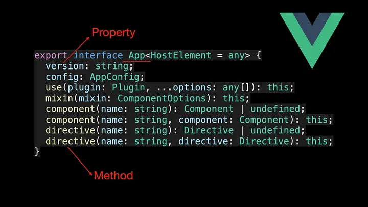

<!--
 * @Author: maxueming maxueming@kuaishou.com
 * @Date: 2023-08-16 18:16:10
 * @LastEditors: maxueming maxueming@kuaishou.com
 * @LastEditTime: 2023-09-19 15:38:28
 * @FilePath: /You-Don-t-Know-TS/vuepress/docs/theme-reco/article-4-en.md
 * @Description: 这是默认设置,请设置`customMade`, 打开koroFileHeader查看配置 进行设置: https://github.com/OBKoro1/koro1FileHeader/wiki/%E9%85%8D%E7%BD%AE
-->

# No More Confusion About TypeScript’s Type and Interface


Welcome to the Mastering TypeScript series. This series will introduce the core knowledge and techniques of TypeScript in the form of animations. Let’s learn together! Previous articles are as follows:

[简体中文](./article-4.md)

- [What Are K, T, and V in TypeScript Generics?](article-1-en.md)
- [Using TypeScript Mapped Types Like a Pro](article-1-en.md)
- [Using TypeScript Conditional Types Like a Pro](article-1-en.md)
- [Using TypeScript Intersection Types Like a Pro](article-1-en.md)
- [Using TypeScript infer Like a Prov](article-1-en.md)
- [Using TypeScript Template Literal Types Like a Prov](article-1-en.md)
- [TypeScript Visualized: 15 Most Used Utility Types](./Advanced-2.md)
- [10 Things You Need To Know About TypeScript Classes](article-1-en.md)
- [The Purpose of ‘declare’ Keyword in TypeScript](article-1-en.md)
- [How To Define Objects Type With Unknown Structures in TypeScript](article-1-en.md)

If you have written TypeScript on your resume, then the interviewer may ask you what the difference is between type and interface. Do you know how to answer this question? If you don’t know, you might understand after reading this article.

Type aliases can be used to give a type a new name, and are helpful when naming non-object types such as primitives or unions:

```typescript
type MyNumber = number;
type StringOrNumber = string | number;
type Text = string | string[];
type Point = [number, number];
type Callback = (data: string) => void;
```

In TypeScript 1.6, type aliases began to support generic types. Utility types such as Partial, Required, Pick, Record, and Exclude which are commonly used in our work, are defined in terms of type alias.


When defining object types, interfaceis usually used. App object in Vue 3 is defined using interface:



As you can see from the above code, when defining an interface, we can declare both properties and methods on the object type. After understanding the role of type and interface, let’s introduce the similarities between them.

## Similarities

> Both type aliases and interface can be used to describe object or function types.

### type alias

```typescript
type Point = {
  x: number;
  y: number;
};
type SetPoint = (x: number, y: number) => void;
```

In the above code, we use the type keyword to alias the object literal type and the function type respectively, so that these types can be used in other places.

### interface

```typescript
interface Point {
  x: number;
  y: number;
}
interface SetPoint {
  (x: number, y: number): void;
}
```

> Both type aliases and interface can be extended

Type aliases are extended by &, while interfaces are extended by extends.


So can an interface extend the type defined by the type alias through extends? The answer is yes. Additionally, type aliases can also extend defined interface types via the & operator:


Now that we know the similarities between type aliases and interfaces, let’s talk about the differences between them.

## Differences

- 1.Type aliases can define aliases for primitive types, union types, or tuple types, while interfaces cannot:

```typescript
type MyNumber = number; // primitive type
type StringOrNumber = string | number; // union type
type Point = [number, number]; // tuple type
```

- 2. Interfaces with the same name are automatically merged(Declaration Merging), while type aliases are not:


Using the feature of declaration merging, we can provide users with better security when developing third-party libraries. For example, the webext-bridge library uses interface to define the ProtocolMap interface, so that users can freely extend the ProtocolMap interface. After that, when using the onMessage function provided inside the library to monitor custom messages, we can infer the message body types corresponding to different messages.

### extends ProtocolMap interface

```typescript
import { ProtocolWithReturn } from "webext-bridge";
declare module "webext-bridge" {
  export interface ProtocolMap {
    foo: { title: string };
    bar: ProtocolWithReturn<CustomDataType, CustomReturnType>;
  }
}
```

### listen for custom messages

```typescript
import { onMessage } from 'webext-bridge'
​
onMessage('foo', ({ data }) => {
 // type of `data` will be `{ title: string }`
 console.log(data.title)
}
```


If you’re interested, take a look at the type definition for onMessage in webext-bridge. If you encounter problems, you can communicate with me. Finally, let’s summarize some usage scenarios for type aliases and interfaces.

### When to use type

- 1.When defining aliases for primitive types, use type
- 2.When defining a tuple type, use type
- 3.When defining a function type, use type
- 4.When defining union types, use type
- 5.When defining the mapped types, use type

### When to use interface

- 1.When you need to take advantage of the declaration merging feature, use interface
- 2.When defining an object type and no need to use type, use interface
  After reading this article, I believe you already understand the difference between type alias and interface.
