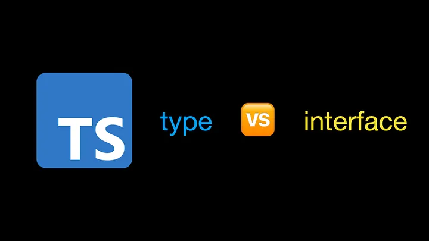
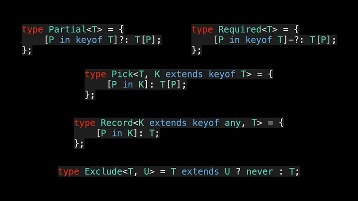
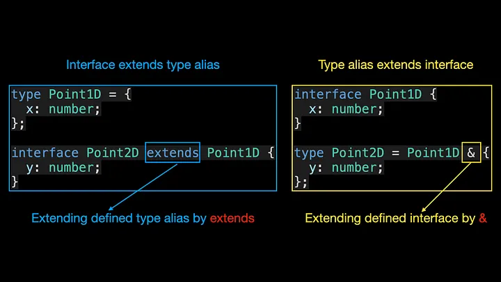

<!--
 * @Author: maxueming maxueming@kuaishou.com
 * @Date: 2023-08-16 18:16:10
 * @LastEditors: maxueming maxueming@kuaishou.com
 * @LastEditTime: 2023-09-19 14:51:27
 * @FilePath: /You-Don-t-Know-TS/vuepress/docs/theme-reco/article-4-en.md
 * @Description: 这是默认设置,请设置`customMade`, 打开koroFileHeader查看配置 进行设置: https://github.com/OBKoro1/koro1FileHeader/wiki/%E9%85%8D%E7%BD%AE
-->

# 不再对 TypeScript 的类型和接口感到困惑



欢迎来到掌握 TypeScript 系列。本系列将以动画的形式介绍 TypeScript 的核心知识和技术。一起来学习吧！往期文章如下：

[English](./article-4-en.md)

- [What Are K, T, and V in TypeScript Generics?](article-1-en.md)
- [Using TypeScript Mapped Types Like a Pro](article-1-en.md)
- [Using TypeScript Conditional Types Like a Pro](article-1-en.md)
- [Using TypeScript Intersection Types Like a Pro](article-1-en.md)
- [Using TypeScript infer Like a Prov](article-1-en.md)
- [Using TypeScript Template Literal Types Like a Prov](article-1-en.md)
- [TypeScript Visualized: 15 Most Used Utility Types](./Advanced-2.md)
- [10 Things You Need To Know About TypeScript Classes](article-1-en.md)
- [The Purpose of ‘declare’ Keyword in TypeScript](article-1-en.md)
- [How To Define Objects Type With Unknown Structures in TypeScript](article-1-en.md)

如果你的简历上写过 TypeScript，那么面试官可能会问你类型和接口有什么区别。你知道如何回答这个问题吗？如果你不知道，看完这篇文章你可能就明白了。

类型别名可用于为类型提供新名称，并且在命名非对象类型（例如基元或联合）时很有用：

```typescript
type MyNumber = number;
type StringOrNumber = string | number;
type Text = string | string[];
type Point = [number, number];
type Callback = (data: string) => void;
```

在 TypeScript 1.6 中，类型别名开始支持泛型类型。我们工作中常用的实用程序类型，例如 Partial、Required、Pick、Record 和 Exclude，都是根据类型别名来定义的。



在定义对象类型时，通常使用接口。 Vue 3 中的 App 对象是使用接口定义的：


从上面的代码可以看出，在定义接口时，我们可以在对象类型上同时声明属性和方法。了解了类型和接口的作用之后，我们来介绍一下它们之间的相似之处。

## 相似点

> 类型别名和接口都可以用来描述对象或函数类型。

### type alias

```typescript
type Point = {
  x: number;
  y: number;
};
type SetPoint = (x: number, y: number) => void;
```

在上面的代码中，我们使用 type 关键字分别为对象字面量类型和函数类型进行别名，以便这些类型可以在其他地方使用。

### interface

```typescript
interface Point {
  x: number;
  y: number;
}
interface SetPoint {
  (x: number, y: number): void;
}
```

> 类型别名和接口都可以扩展

类型别名由 & 扩展，而接口由 extends 扩展。


那么接口是否可以通过 extends 来扩展类型别名定义的类型呢？答案是肯定的。此外，类型别名还可以通过 & 运算符扩展定义的接口类型：




现在我们知道了类型别名和接口之间的相似之处，让我们来谈谈它们之间的区别。

## 不同点

- 1.类型别名可以为基元类型、联合类型或元组类型定义别名，而接口则不能：

```typescript
type MyNumber = number; // primitive type
type StringOrNumber = string | number; // union type
type Point = [number, number]; // tuple type
```

- 2. 同名的接口会自动合并（声明合并），而类型别名则不会：


利用声明合并的特性，我们可以为用户在开发第三方库时提供更好的安全性。例如，webext-bridge 库使用 interface 来定义 ProtocolMap 接口，以便用户可以自由扩展 ProtocolMap 接口。之后，当使用库内部提供的 onMessage 函数监听自定义消息时，我们可以推断出不同消息对应的消息体类型。

### 扩展 ProtocolMap 接口

```typescript
import { ProtocolWithReturn } from "webext-bridge";
declare module "webext-bridge" {
  export interface ProtocolMap {
    foo: { title: string };
    bar: ProtocolWithReturn<CustomDataType, CustomReturnType>;
  }
}
```

### 监听自定义消息

```typescript
import { onMessage } from 'webext-bridge'
​
onMessage('foo', ({ data }) => {
 // type of `data` will be `{ title: string }`
 console.log(data.title)
}
```


如果您有兴趣，请查看 webext-bridge 中 onMessage 的类型定义。如果遇到问题可以和我交流。最后总结一下类型别名和接口的一些使用场景。

### 何时使用类型

- 1.为基本类型定义别名时，使用 type
- 2.定义元组类型时，使用 type
- 3.定义函数类型时，使用 type
- 4.定义联合类型时，使用 type
- 5.定义映射类型时，使用 type

### 何时使用 interface

- 1.当您需要利用声明合并功能时，请使用接口
- 2.定义对象类型时不需要使用类型，使用接口

  After reading this article, I believe you already understand the difference between type alias and interface.
