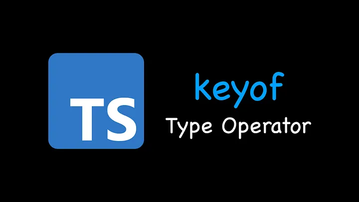
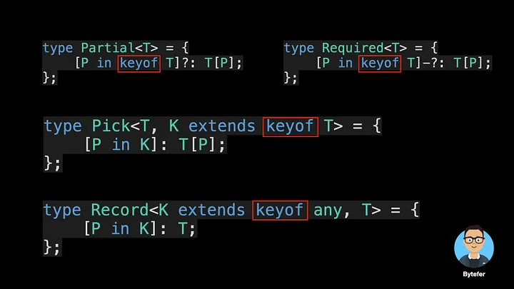
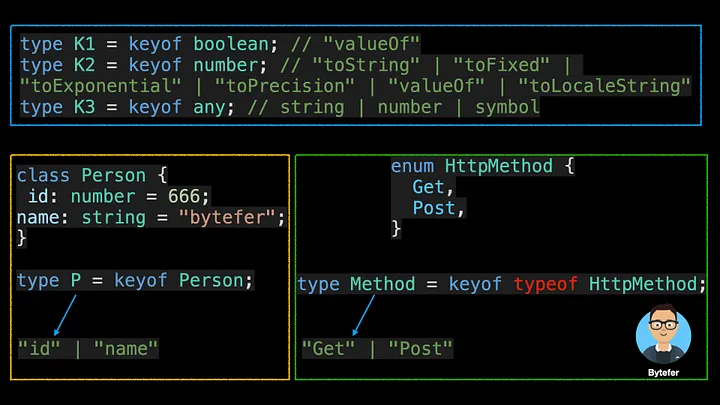
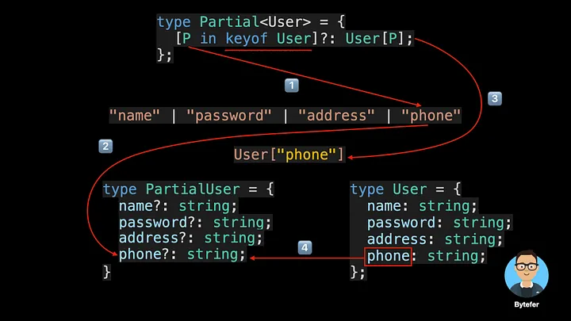

# Master the TypeScript Keyof Type Operator



Welcome to the Mastering TypeScript series. This series will introduce the core knowledge and techniques of TypeScript in the form of animations. Let’s learn together! Previous articles are as follows:

[简体中文](./article-5.md)

- [What Are K, T, and V in TypeScript Generics?](article-1-en.md)
- [Using TypeScript Mapped Types Like a Pro](article-1-en.md)
- [Using TypeScript Conditional Types Like a Pro](article-1-en.md)
- [Using TypeScript Intersection Types Like a Pro](article-1-en.md)
- [Using TypeScript infer Like a Prov](article-1-en.md)
- [Using TypeScript Template Literal Types Like a Prov](article-1-en.md)
- [TypeScript Visualized: 15 Most Used Utility Types](./Advanced-2.md)
- [10 Things You Need To Know About TypeScript Classes](article-1-en.md)
- [The Purpose of ‘declare’ Keyword in TypeScript](article-1-en.md)
- [How To Define Objects Type With Unknown Structures in TypeScript](article-1-en.md)

Have you used the Partial, Required, Pick, and Record utility types in TypeScript?



The keyof type operator is used inside these utility types, so what does this operator do? If it is not clear, after reading this article, maybe you will understand.

In JavaScript, we can get the keys in an object through the Object.keys method, which returns an array of keys.

```typescript
const user = {
  id: 666,
  name: "bytefer",
};
const keys = Object.keys(user); // ["id", "name"]
```

In TypeScript, we are dealing with types. If you want to get the key in the object type, you need to use the keyof type operator. Introduced in TypeScript 2.1, this operator is used to get all keys in a type and its return type is a union type.

```typescript
type User = {
  id: number;
  name: string;
};
type UserKeys = keyof User; // "id" | "name"
```

After obtaining the key of an object type, we can access the type of the value corresponding to that key by using a syntax similar to that used for property access.

```typescript
type U1 = User["id"]; // number
type U2 = User["id" | "name"]; // string | number
type U3 = User[keyof User]; // string | number
```

For the above code, we use an indexed access type to look up a specific property on User type. The indexing type is itself a type, so we can use unions, keyofor other types entirely.

So what are the uses of the keyof operator in practice? Here we take an example.

```typescript
function getProperty(obj, key) {
  return obj[key];
}
const user = {
  id: 666,
  name: "bytefer",
};
const userName = getProperty(user, "name");
```

This is a simple getProperty function, which receives two parameters, obj and key, and is used to obtain the property value corresponding to the parameter key on the obj object.

So how to define the above getProperty function in TypeScript? Here we put the function directly into the TypeScript project. For the above code, the TypeScript compiler will prompt the following error message:


This information tells us that the parameters obj and key implicitly have “any” type. To solve this problem, we can explicitly define the types of the parameter obj and key.


```ts
Element implicitly has an 'any' type because expression of type 'string' can't be used to index type '{}'.
  No index signature with a parameter of type 'string' was found on type '{}'.ts(7053)
```

The error message on the parameter disappears after the type is explicitly specified, but a new error message appears in the function body. So how to solve the above problems? Here we can use TypeScript generics and the keyof operator:

```typescript
function getProperty<T extends object, K extends keyof T>(obj: T, key: K) {
  return obj[key];
}
```

In the above code, we define two type parameters: T and K. For the type parameter T, extends is used to constrain the actual type of the type parameter to be a subtype of the object type. The type parameter K also uses extends to constrain the actual type of the type parameter to be a subtype of the union type of all keys of the object type.

If you are not familiar with type parameters, I recommend you to read the following article:

[What Are K, T, and V in TypeScript Generics?](./article-1.md)

Explained With Animations, Let You Easily Master TypeScript Generic Type Parameters.
medium.com

After that, using the getProperty function, we can get the value of the specified property on an object. When the property corresponding to the key does not exist, TypeScript will prompt the corresponding error message.


The keyof type operator can be applied not only to object types, but also to primitive data types, any type, class, and enumerated types.



The aforementioned TypeScript built-in utility types such as Partial, Required, Pick, and Record all use the keyof type operator and mapped types internally. If you want to learn more about TypeScript mapped types, we recommend reading this article.
[Using TypeScript Mapped Types Like a Pro](./article-21.md)

In order to let everyone better understand the role of the keyof type operator, I will use the Partial utility type as an example to demonstrate its workflow:


```typescript
/**
 * Make all properties in T optional.
 * typescript/lib/lib.es5.d.ts
 */
type Partial<T> = {
  [P in keyof T]?: T[P];
};
```




At this point, I believe you already know the role of the keyof type operator in TypeScript’s built-in utility types. If you want to learn TypeScript, then don’t miss the Mastering TypeScript series.
