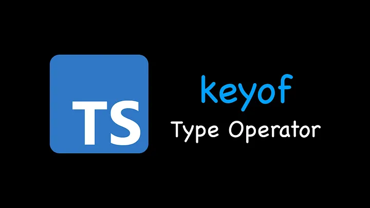
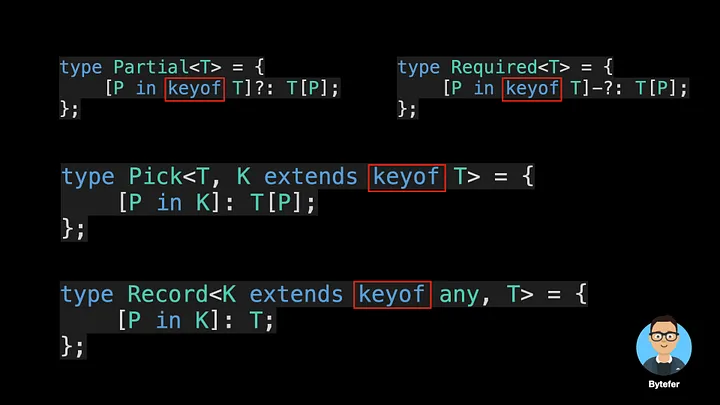
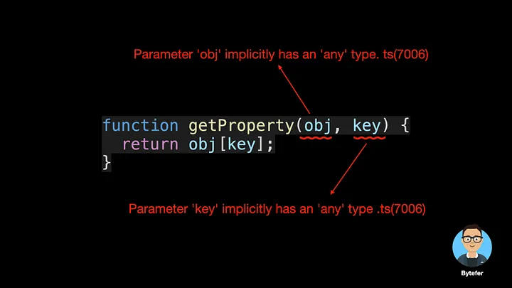
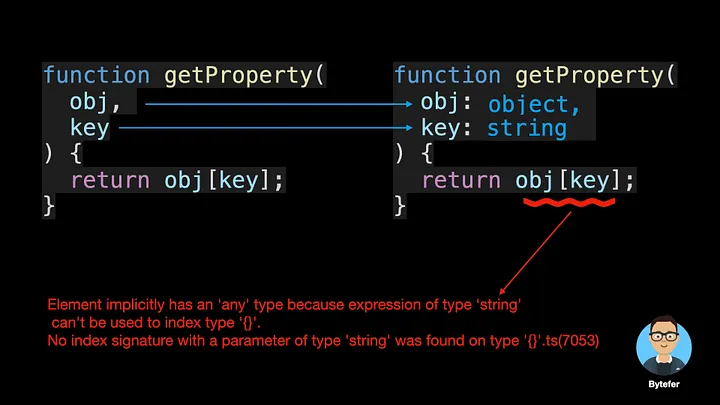
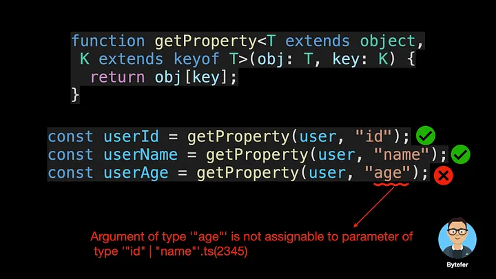
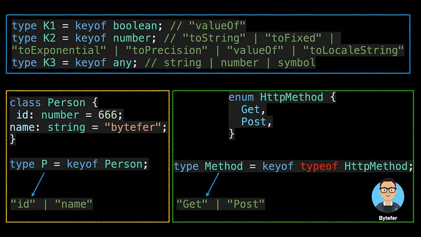
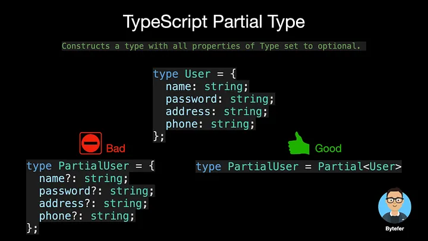
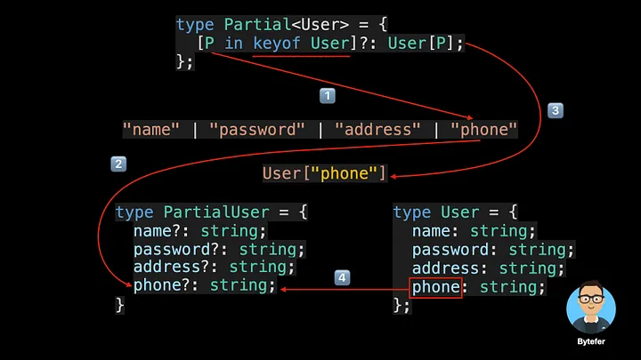

# 掌握 TypeScript Keyof 类型运算符



欢迎来到掌握 TypeScript 系列。本系列将以动画的形式介绍 TypeScript 的核心知识和技术。一起来学习吧！往期文章如下：

[English](./article-5-en.md)

- [What Are K, T, and V in TypeScript Generics?](article-1-en.md)
- [Using TypeScript Mapped Types Like a Pro](article-1-en.md)
- [Using TypeScript Conditional Types Like a Pro](article-1-en.md)
- [Using TypeScript Intersection Types Like a Pro](article-1-en.md)
- [Using TypeScript infer Like a Prov](article-1-en.md)
- [Using TypeScript Template Literal Types Like a Prov](article-1-en.md)
- [TypeScript Visualized: 15 Most Used Utility Types](./Advanced-2.md)
- [10 Things You Need To Know About TypeScript Classes](article-1-en.md)
- [The Purpose of ‘declare’ Keyword in TypeScript](article-1-en.md)
- [How To Define Objects Type With Unknown Structures in TypeScript](article-1-en.md)

您在 TypeScript 中使用过 Partial、Required、Pick 和 Record 实用程序类型吗？



这些实用程序类型内部使用了 keyof 类型运算符，那么这个运算符有什么作用呢？如果还不清楚，看完这篇文章，也许你就会明白了。

在 JavaScript 中，我们可以通过 Object.keys 方法获取对象中的键，该方法返回一个键数组。

```typescript
const user = {
  id: 666,
  name: "bytefer",
};
const keys = Object.keys(user); // ["id", "name"]
```

在 TypeScript 中，我们正在处理类型。如果想要获取对象类型中的 key，需要使用 keyof 类型运算符。 TypeScript 2.1 中引入，该运算符用于获取类型中的所有键，其返回类型是联合类型。

```typescript
type User = {
  id: number;
  name: string;
};
type UserKeys = keyof User; // "id" | "name"
```

获得对象类型的键后，我们可以使用类似于属性访问的语法来访问该键对应的值的类型。

```typescript
type U1 = User["id"]; // number
type U2 = User["id" | "name"]; // string | number
type U3 = User[keyof User]; // string | number
```

对于上面的代码，我们使用索引访问类型来查找 User 类型的特定属性。索引类型本身就是一种类型，因此我们可以完全使用 union、keyof 等其他类型。

那么 keyof 运算符在实际中有何用途呢？这里我们举一个例子。

```typescript
function getProperty(obj, key) {
  return obj[key];
}
const user = {
  id: 666,
  name: "bytefer",
};
const userName = getProperty(user, "name");
```

这是一个简单的 getProperty 函数，它接收两个参数 obj 和 key，用于获取 obj 对象上参数 key 对应的属性值。

那么如何在 TypeScript 中定义上面的 getProperty 函数呢？这里我们将函数直接放入 TypeScript 项目中。对于上面的代码，TypeScript 编译器会提示以下错误信息：



此信息告诉我们参数 obj 和 key 隐式具有“any”类型。为了解决这个问题，我们可以显式定义参数 obj 和 key 的类型。



```ts
Element implicitly has an 'any' type because expression of type 'string' can't be used to index type '{}'.
  No index signature with a parameter of type 'string' was found on type '{}'.ts(7053)
```

显式指定类型后，参数上的错误消息消失，但函数体中出现新的错误消息。那么如何解决以上问题呢？这里我们可以使用 TypeScript 泛型和 keyof 运算符：

```typescript
function getProperty<T extends object, K extends keyof T>(obj: T, key: K) {
  return obj[key];
}
```

在上面的代码中，我们定义了两个类型参数：T 和 K。对于类型参数 T，使用 extends 来约束类型参数的实际类型为对象类型的子类型。类型参数 K 还使用 extends 来将类型参数的实际类型约束为对象类型的所有键的联合类型的子类型。

如果您对类型参数不熟悉，我建议您阅读以下文章：

[What Are K, T, and V in TypeScript Generics?](./article-1.md)

之后，使用 getProperty 函数，我们可以获得对象上指定属性的值。当 key 对应的属性不存在时，TypeScript 会提示相应的错误信息。



keyof 类型运算符不仅可以应用于对象类型，还可以应用于原始数据类型、任何类型、类和枚举类型。



前面提到的 TypeScript 内置实用程序类型（例如 Partial、Required、Pick 和 Record）都在内部使用 keyof 类型运算符和映射类型。如果您想了解有关 TypeScript 映射类型的更多信息，我们建议您阅读这篇文章。

[Using TypeScript Mapped Types Like a Pro](./article-21.md)

为了让大家更好地理解 keyof 类型运算符的作用，我以 Partial utility 类型为例演示其工作流程：



```typescript
/**
 * Make all properties in T optional.
 * typescript/lib/lib.es5.d.ts
 */
type Partial<T> = {
  [P in keyof T]?: T[P];
};
```




至此，我相信你已经知道 keyof 类型运算符在 TypeScript 内置实用类型中的作用了。如果你想学习 TypeScript，那么不要错过掌握 TypeScript 系列。
