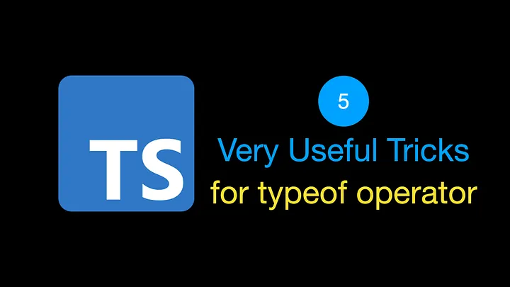
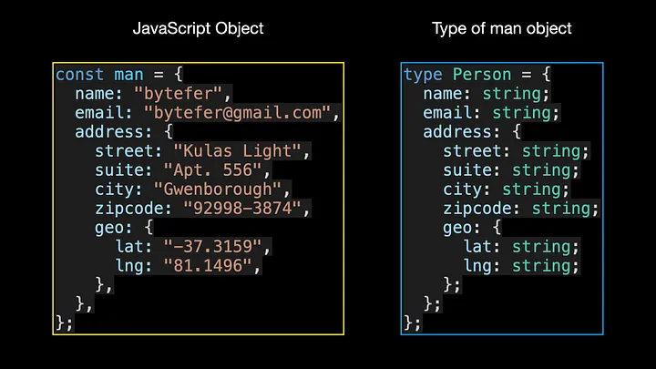
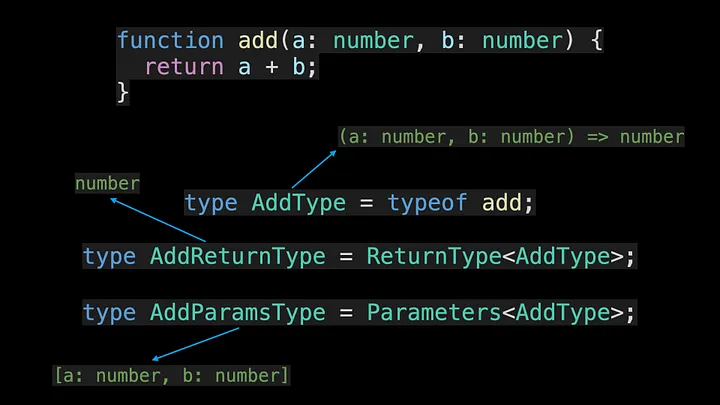
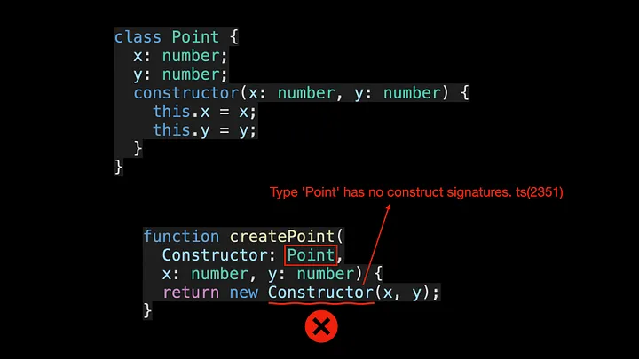

<!--
 * @Author: maxueming maxueming@kuaishou.com
 * @Date: 2023-08-16 17:22:20
 * @LastEditors: maxueming maxueming@kuaishou.com
 * @LastEditTime: 2023-09-20 11:06:50
 * @FilePath: /You-Don-t-Know-TS/vuepress/docs/theme-reco/article-1.md
 * @Description: 这是默认设置,请设置`customMade`, 打开koroFileHeader查看配置 进行设置: https://github.com/OBKoro1/koro1FileHeader/wiki/%E9%85%8D%E7%BD%AE
-->

# 5 Very Useful Tricks for TypeScript Typeof Operator



Welcome to the Mastering TypeScript series. This series will introduce the core knowledge and techniques of TypeScript in the form of animations. Let’s learn together! Previous articles are as follows:

[简体中文](./article-6.md)

- [What Are K, T, and V in TypeScript Generics?](article-1-en.md)
- [Using TypeScript Mapped Types Like a Pro](article-1-en.md)
- [Using TypeScript Conditional Types Like a Pro](article-1-en.md)
- [Using TypeScript Intersection Types Like a Pro](article-1-en.md)
- [Using TypeScript infer Like a Prov](article-1-en.md)
- [Using TypeScript Template Literal Types Like a Prov](article-1-en.md)
- [TypeScript Visualized: 15 Most Used Utility Types](./Advanced-2.md)
- [10 Things You Need To Know About TypeScript Classes](article-1-en.md)
- [The Purpose of ‘declare’ Keyword in TypeScript](article-1-en.md)
- [How To Define Objects Type With Unknown Structures in TypeScript](article-1-en.md)

In JavaScript, you can get the type of a variable through the typeof operator, so do you know what the typeof operator is used in TypeScript? In this article, I will introduce 5 common application scenarios of the typeof operator, which you may use in future projects.

## 1. Get the type of the object


The man object is a regular JavaScript object, in TypeScript you can use type or interface to define the type of the object. With this object type, you can use TypeScript’s built-in utility types, such as Partial, Required, Pick, or Readonly, to handle object types to meet different needs.

For simple objects, this may not be a big deal. But for large, complex objects with deeper nesting levels, manually defining their types can be mind-numbing. To solve this problem, you can use the typeof operator.

```typescript
type Person = typeof man;
type Address = Person["address"];
```

Compared to manually defining the type before, it becomes much easier to use the typeof operator. Person["address"] is an indexed access type to look up a specific property (address) on another type (Person type).

## 2. Get a Type That Represents All Enum Keys As Strings

In TypeScript, enums types are special types that get compiled into regular JavaScript objects:


Therefore, you can also use the typeof operator on enums types. But this is often not of much practical use, and when dealing with enums types, it is usually combined with the keyof operator:


## 3. Get the Type of the Function Object

There is another more common scenario in which the typeof operator is used in your work. After obtaining the corresponding function type, you can continue to use TypeScript’s built-in ReturnType and Parameters utility types to obtain the function’s return value type and parameter type, respectively.



## 4. Get the Type of the Class Object

Since the typeof operator can handle function objects, it can handle Class objects? The answer is yes.

In the above code, createPoint is a factory function that creates an instance of the Point class. Through the typeof operator, you can obtain the corresponding construct signature of the Point class, so as to realize the corresponding type verification. When defining the parameter type of Constructor, if the typeof operator is not used, the following error message will appear:


## 5. Get a More Precise Type

When using the typeof operator, if you want to get a more precise type, then you can combine it with the const assertion introduced in TypeScript version 3.4. This is used in the following way.



As can be seen from the above figure, after using the const assertion, and then using the typeof operator, we can obtain a more precise type.
