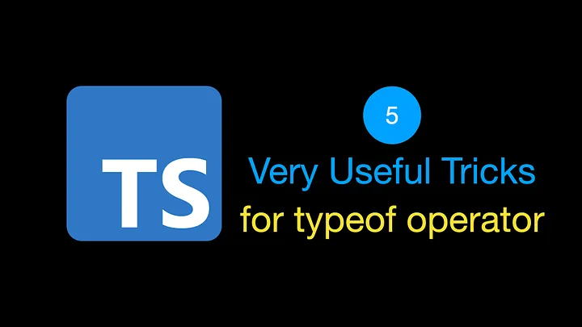
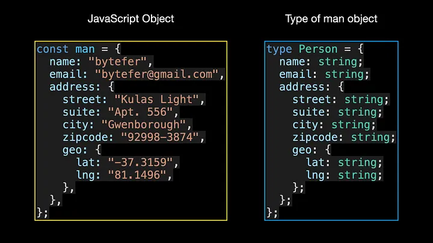
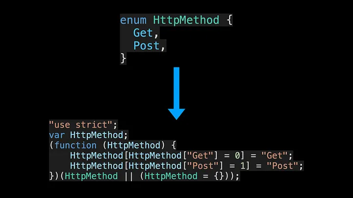
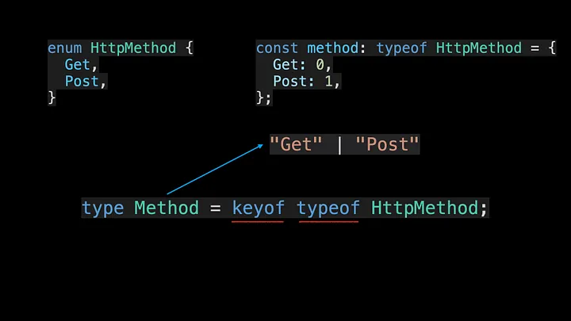
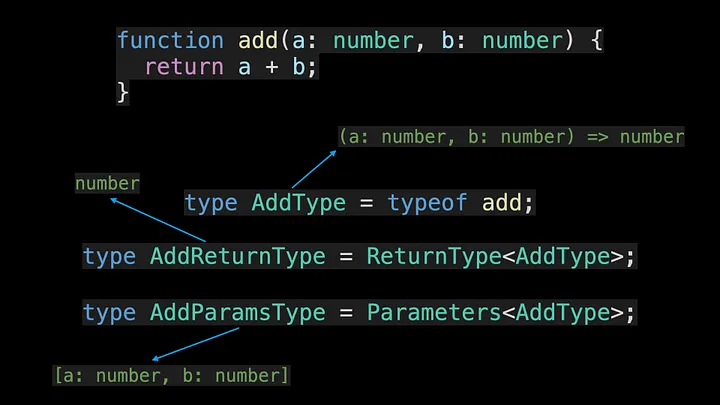
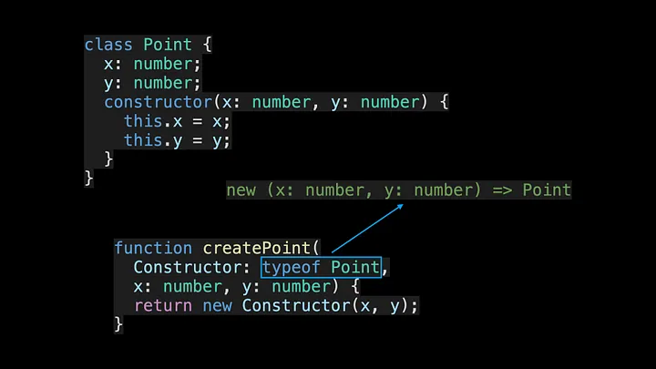
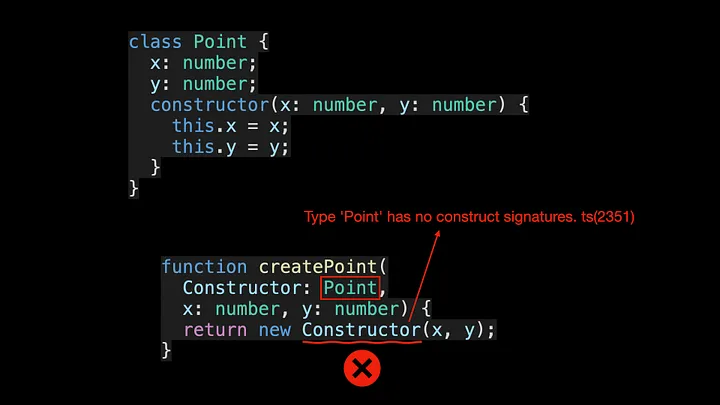
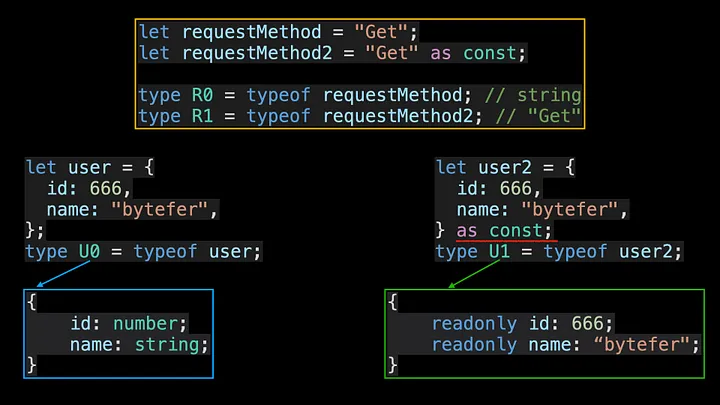

<!--
 * @Author: maxueming maxueming@kuaishou.com
 * @Date: 2023-08-16 17:22:20
 * @LastEditors: maxueming maxueming@kuaishou.com
 * @LastEditTime: 2023-09-20 11:13:54
 * @FilePath: /You-Don-t-Know-TS/vuepress/docs/theme-reco/article-1.md
 * @Description: 这是默认设置,请设置`customMade`, 打开koroFileHeader查看配置 进行设置: https://github.com/OBKoro1/koro1FileHeader/wiki/%E9%85%8D%E7%BD%AE
-->

# TypeScript Typeof 运算符的 5 个非常有用的技巧



欢迎来到掌握 TypeScript 系列。本系列将以动画的形式介绍 TypeScript 的核心知识和技术。一起来学习吧！往期文章如下：

[English](./article-6-en.md)

- [What Are K, T, and V in TypeScript Generics?](article-1-en.md)
- [Using TypeScript Mapped Types Like a Pro](article-1-en.md)
- [Using TypeScript Conditional Types Like a Pro](article-1-en.md)
- [Using TypeScript Intersection Types Like a Pro](article-1-en.md)
- [Using TypeScript infer Like a Prov](article-1-en.md)
- [Using TypeScript Template Literal Types Like a Prov](article-1-en.md)
- [TypeScript Visualized: 15 Most Used Utility Types](./Advanced-2.md)
- [10 Things You Need To Know About TypeScript Classes](article-1-en.md)
- [The Purpose of ‘declare’ Keyword in TypeScript](article-1-en.md)
- [How To Define Objects Type With Unknown Structures in TypeScript](article-1-en.md)

在 JavaScript 中，可以通过 typeof 运算符获取变量的类型，那么你知道 typeof 运算符在 TypeScript 中的用途吗？在这篇文章中，我将介绍 typeof 运算符的 5 个常见应用场景，您可能会在以后的项目中使用它们。

## 1. 获取对象类型



man 对象是一个常规的 JavaScript 对象，在 TypeScript 中你可以使用类型或接口来定义对象的类型。通过这种对象类型，您可以使用 TypeScript 的内置实用程序类型（例如 Partial、Required、Pick 或 Readonly）来处理对象类型，以满足不同的需求。

对于简单的对象来说，这可能不是什么大问题。但对于具有更深嵌套级别的大型复杂对象，手动定义其类型可能会令人头脑麻木。要解决这个问题，可以使用 typeof 运算符。

```typescript
type Person = typeof man;
type Address = Person["address"];
```

与之前手动定义类型相比，使用 typeof 运算符变得更加容易。 Person["address"] 是一种索引访问类型，用于查找另一种类型（Person 类型）上的特定属性（地址）。

## 2. 获取将所有枚举键表示为字符串的类型

在 TypeScript 中，枚举类型是被编译成常规 JavaScript 对象的特殊类型：



因此，您还可以对枚举类型使用 typeof 运算符。但这通常没有多大实际用处，在处理枚举类型时，它通常与 keyof 运算符结合使用：



## 3. 获取函数对象的类型

还有另一种更常见的场景，在您的工作中使用 typeof 运算符。获取对应的函数类型后，可以继续使用 TypeScript 内置的 ReturnType 和 Parameters 实用程序类型来分别获取函数的返回值类型和参数类型。



## 4. 获取类对象的类型

既然 typeof 运算符可以处理函数对象，那么它也可以处理 Class 对象吗？答案是肯定的



在上面的代码中，createPoint 是一个工厂函数，用于创建 Point 类的实例。通过 typeof 运算符，可以获得 Point 类对应的构造签名，从而实现对应的类型验证。定义 Constructor 的参数类型时，如果不使用 typeof 运算符，会出现如下错误信息：



## 5. 获得更精确的类型

使用 typeof 运算符时，如果您想获得更精确的类型，则可以将其与 TypeScript 3.4 版本中引入的 const 断言结合起来。这是按以下方式使用的。


As can be seen from the above figure, after using the const assertion, and then using the typeof operator, we can obtain a more precise type.
