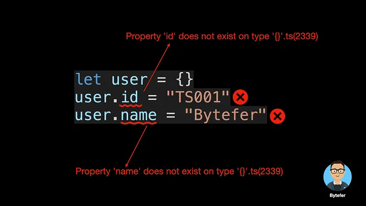
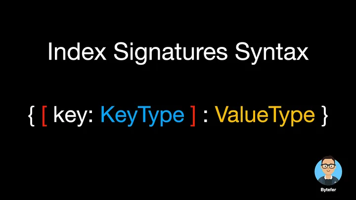
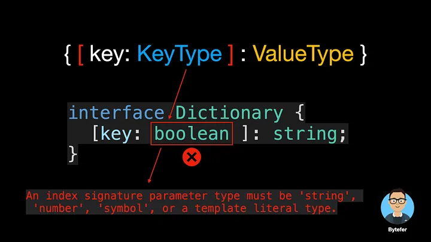
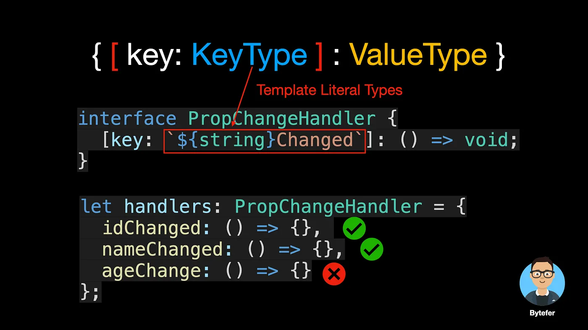
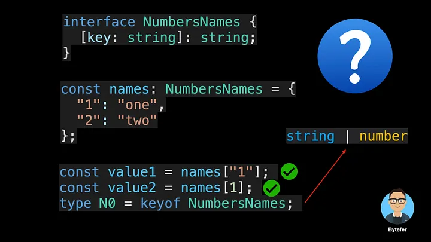
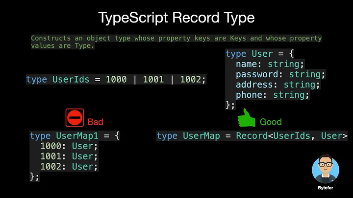
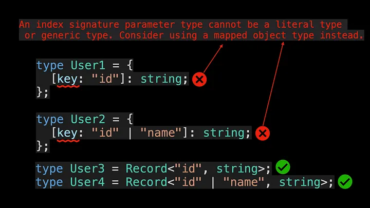

<!--
 * @Author: maxueming maxueming@kuaishou.com
 * @Date: 2023-08-16 17:22:20
 * @LastEditors: maxueming maxueming@kuaishou.com
 * @LastEditTime: 2023-09-20 11:26:22
 * @FilePath: /You-Don-t-Know-TS/vuepress/docs/theme-reco/article-1.md
 * @Description: 这是默认设置,请设置`customMade`, 打开koroFileHeader查看配置 进行设置: https://github.com/OBKoro1/koro1FileHeader/wiki/%E9%85%8D%E7%BD%AE
-->

# How To Define Objects Type With Unknown Structures in TypeScript


Welcome to the Mastering TypeScript series. This series will introduce the core knowledge and techniques of TypeScript in the form of animations. Let’s learn together! Previous articles are as follows:

[简体中文](./article-7.md)

- [What Are K, T, and V in TypeScript Generics?](article-1-en.md)
- [Using TypeScript Mapped Types Like a Pro](article-1-en.md)
- [Using TypeScript Conditional Types Like a Pro](article-1-en.md)
- [Using TypeScript Intersection Types Like a Pro](article-1-en.md)
- [Using TypeScript infer Like a Prov](article-1-en.md)
- [Using TypeScript Template Literal Types Like a Prov](article-1-en.md)
- [TypeScript Visualized: 15 Most Used Utility Types](./Advanced-2.md)
- [10 Things You Need To Know About TypeScript Classes](article-1-en.md)
- [The Purpose of ‘declare’ Keyword in TypeScript](article-1-en.md)
- [How To Define Objects Type With Unknown Structures in TypeScript](article-1-en.md)

Did you encounter similar errors when you were learning TypeScript?



To fix this error, a very violent way is to use any type:

```typescript
let user: any = {};
user.id = "TS001";
user.name = "Bytefer";
```

Besides using any type, how many solutions do you know? In this article, I will introduce 3 other solutions. Before you continue reading, I suggest you take a moment to think about it.


Photo by Aron Visuals on Unsplash
One of the solutions is to use type or interface to define a User type:

```typescript
interface User {
  id: string;
  name: string;
}
let user = {} as User;
user.id = "TS001";
user.name = "Bytefer";
```

Although using the User type, the previous problem can be solved. But if you set a new age property for the user object, the following error message will be displayed:

```typescript
Property 'age' does not exist on type 'User'.ts(2339)
```

So how should we solve the problem of dynamic property assignment? At this point, we can use TypeScript’s index signatures. When we only know the type of the object keys and values, we can use index signatures to define the type of that object. The syntax of the index signatures is as follows:



The type of the key can only be string, number, symbol, or template literal type, while the type of the value can be any type.



The template literal types is a new type introduced in TypeScript 4.1, and in combination with index signatures, we can define more powerful types.



If you want to learn more about template literal types, I recommend you read this article:

[Using TypeScript Template Literal Types Like a Pro](./article-24.md)

Once we understand the syntax of the index signatures, we can easily define a new User type:

```typescript
interface User {
  id: string;
  name: string;
  [key: string]: string;
}
```

Where id and name are already properties, we set the type of other properties of User type to string type by index signatures. When using index signatures, you may encounter these confusions:



- Why can the corresponding property value be accessed through the string “1” and the number 1?
- Why does keyof NumbersNames return a union type of string and number types?
  `This is because JavaScript implicitly coerces numbers to strings when used as keys in property accessors, and TypeScript performs this conversion as well.`

In addition to using index signatures, we can also use TypeScript’s built-in utility type Record type to define the User type. The role of the Record utility type is as follows:



```typescript
type User = Record<string, string>;
let user = {} as User;
user.id = "TS001"; // Ok
user.name = "Bytefer"; // Ok
```

So what’s the difference between an index signatures and a Record utility type? In some cases, they all define the expected type.

```typescript
const user1: Record<string, string> = { name: "Bytefer" }; // Ok
const user2: { [key: string]: string } = { name: "Bytefer" }; // Ok
```

For index signatures, the key type can only be string, number, symbol, or template literal type. For the Record utility type, the key type can be a literal type or a union of literal types:


To get a better grasp of the Record utility type, let’s take a look at its internal implementation:

```typescript
/**
 * Construct a type with a set of properties K of type T.
 * typescript/lib/lib.es5.d.ts
 */
type Record<K extends keyof any, T> = {
  [P in K]: T;
};
```

The Record utility type uses the TypeScript mapped types internally, which is used in other built-in utility types. If you want to learn more about TypeScript mapped types, I recommend you read the following article carefully:

[Using TypeScript Mapped Types Like a Pro](./article-21.md)

After reading this article, I believe you already understand TypeScript index types and Record Record utility types. If you want to learn TypeScript, then don’t miss the Mastering TypeScript series.
