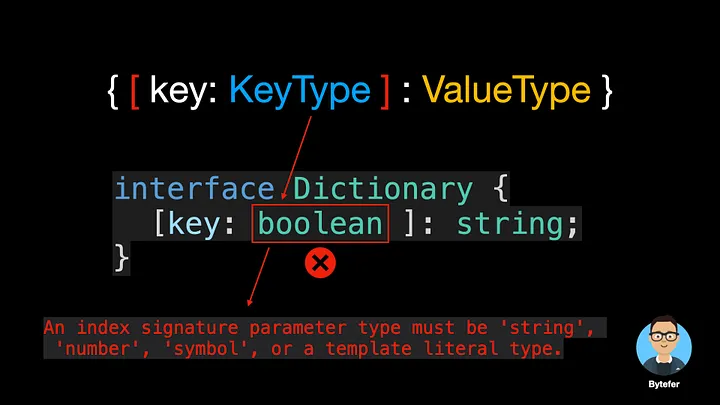
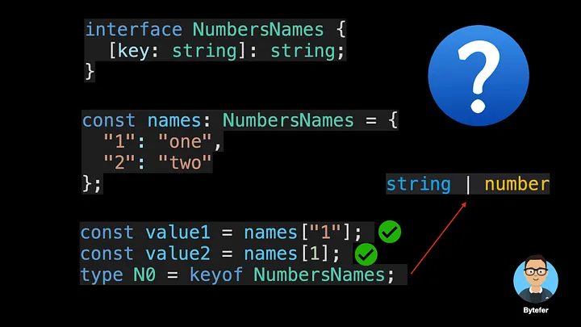
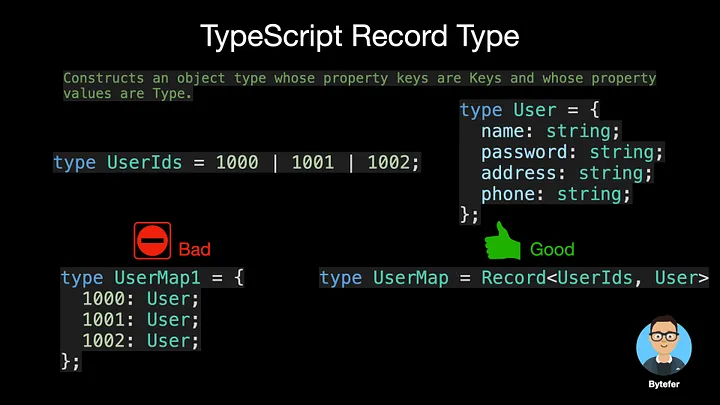

<!--
 * @Author: maxueming maxueming@kuaishou.com
 * @Date: 2023-08-16 17:22:20
 * @LastEditors: maxueming maxueming@kuaishou.com
 * @LastEditTime: 2023-09-20 11:47:18
 * @FilePath: /You-Don-t-Know-TS/vuepress/docs/theme-reco/article-1.md
 * @Description: 这是默认设置,请设置`customMade`, 打开koroFileHeader查看配置 进行设置: https://github.com/OBKoro1/koro1FileHeader/wiki/%E9%85%8D%E7%BD%AE
-->

# 如何在 TypeScript 中定义具有未知结构的对象类型


欢迎来到掌握 TypeScript 系列。本系列将以动画的形式介绍 TypeScript 的核心知识和技术。一起来学习吧！往期文章如下：

[English](./article-7-en.md)

- [What Are K, T, and V in TypeScript Generics?](article-1-en.md)
- [Using TypeScript Mapped Types Like a Pro](article-1-en.md)
- [Using TypeScript Conditional Types Like a Pro](article-1-en.md)
- [Using TypeScript Intersection Types Like a Pro](article-1-en.md)
- [Using TypeScript infer Like a Prov](article-1-en.md)
- [Using TypeScript Template Literal Types Like a Prov](article-1-en.md)
- [TypeScript Visualized: 15 Most Used Utility Types](./Advanced-2.md)
- [10 Things You Need To Know About TypeScript Classes](article-1-en.md)
- [The Purpose of ‘declare’ Keyword in TypeScript](article-1-en.md)
- [How To Define Objects Type With Unknown Structures in TypeScript](article-1-en.md)

你在学习 TypeScript 的时候有遇到过类似的错误吗？


要修复这个错误，一个非常暴力的方法就是使用 any 类型：

```typescript
let user: any = {};
user.id = "TS001";
user.name = "Bytefer";
```

除了使用任何类型之外，您还知道多少种解决方案？在这篇文章中，我将介绍另外 3 个解决方案。在继续阅读之前，我建议您花点时间考虑一下。


解决方案之一是使用类型或接口来定义 User 类型：

```typescript
interface User {
  id: string;
  name: string;
}
let user = {} as User;
user.id = "TS001";
user.name = "Bytefer";
```

虽然使用 User 类型，但是可以解决之前的问题。但如果为用户对象设置新的年龄属性，则会显示以下错误消息

```typescript
Property 'age' does not exist on type 'User'.ts(2339)
```

那么我们应该如何解决动态属性分配的问题呢？此时，我们可以使用 TypeScript 的索引签名。当我们只知道对象键和值的类型时，我们可以使用索引签名来定义该对象的类型。索引签名的语法如下：


键的类型只能是字符串、数字、符号或模板文字类型，而值的类型可以是任意类型。



模板文字类型是 TypeScript 4.1 中引入的新类型，结合索引签名，我们可以定义更强大的类型。


如果您想了解有关模板文字类型的更多信息，我建议您阅读这篇文章：

[Using TypeScript Template Literal Types Like a Pro](./article-24.md)

一旦我们理解了索引签名的语法，我们就可以轻松定义一个新的 User 类型：

```typescript
interface User {
  id: string;
  name: string;
  [key: string]: string;
}
```

其中 id 和 name 已经是属性，我们通过索引签名将 User 类型的其他属性的类型设置为字符串类型。在使用索引签名时，您可能会遇到以下困惑：



- 为什么可以通过字符串“1”和数字 1 来访问对应的属性值呢？
- 为什么 keyof NumbersNames 返回字符串和数字类型的联合类型？
  `这是因为当用作属性访问器中的键时，JavaScript 会隐式地将数字强制转换为字符串，并且 TypeScript 也会执行此转换。`

除了使用索引签名之外，我们还可以使用 TypeScript 内置的实用程序类型 Record 类型来定义 User 类型。 Record 实用程序类型的作用如下：



```typescript
type User = Record<string, string>;
let user = {} as User;
user.id = "TS001"; // Ok
user.name = "Bytefer"; // Ok
```

那么索引签名和记录实用程序类型之间有什么区别？在某些情况下，它们都定义了预期的类型。

```typescript
const user1: Record<string, string> = { name: "Bytefer" }; // Ok
const user2: { [key: string]: string } = { name: "Bytefer" }; // Ok
```

对于索引签名，密钥类型只能是字符串、数字、符号或模板文字类型。对于 Record 实用程序类型，键类型可以是文字类型或文字类型的联合：


为了更好地理解 Record 实用程序类型，让我们看一下它的内部实现：

```typescript
/**
 * Construct a type with a set of properties K of type T.
 * typescript/lib/lib.es5.d.ts
 */
type Record<K extends keyof any, T> = {
  [P in K]: T;
};
```

Record 实用程序类型在内部使用 TypeScript 映射类型，该类型在其他内置实用程序类型中使用。如果您想了解更多有关 TypeScript 映射类型的信息，我建议您仔细阅读以下文章：

[Using TypeScript Mapped Types Like a Pro](./article-21.md)

After reading this article, I believe you already understand TypeScript index types and Record Record utility types. If you want to learn TypeScript, then don’t miss the Mastering TypeScript series.
