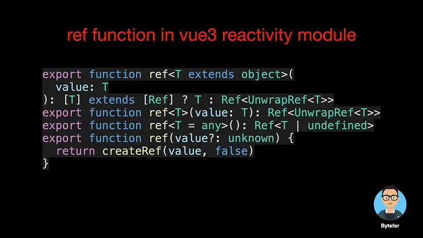
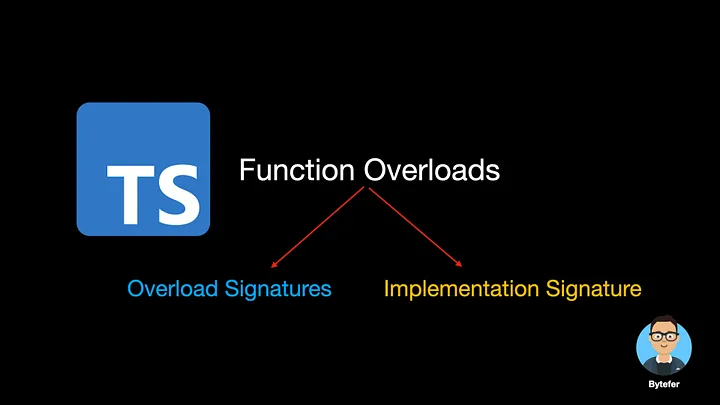
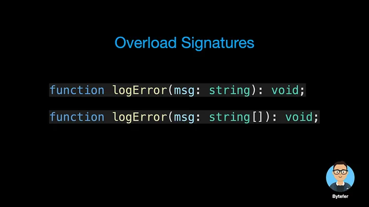
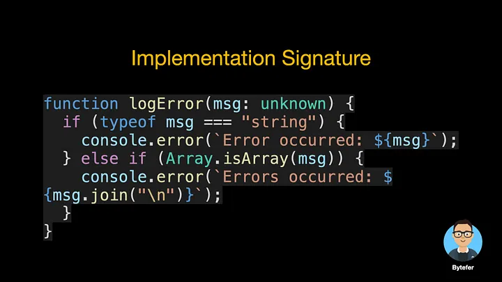
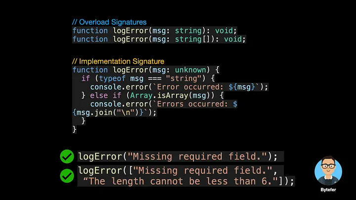
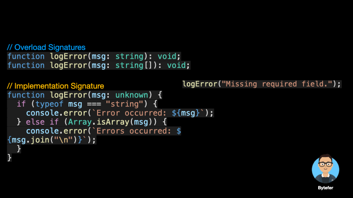
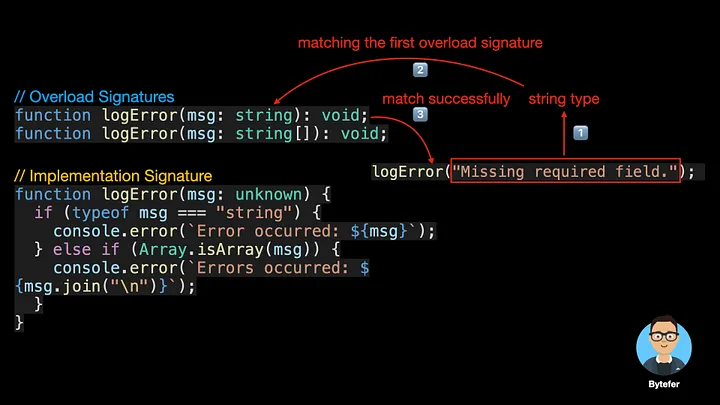

<!--
 * @Author: maxueming maxueming@kuaishou.com
 * @Date: 2023-08-16 17:22:20
 * @LastEditors: maxueming maxueming@kuaishou.com
 * @LastEditTime: 2023-09-21 16:57:47
 * @FilePath: /You-Don-t-Know-TS/vuepress/docs/theme-reco/article-1.md
 * @Description: 这是默认设置,请设置`customMade`, 打开koroFileHeader查看配置 进行设置: https://github.com/OBKoro1/koro1FileHeader/wiki/%E9%85%8D%E7%BD%AE
-->

# What Are Function Overloads in TypeScript?

A Simple Explanation of Function Overloading in TypeScript, Helps You Understand Overload Signatures and Implementation Signature.


Welcome to the Mastering TypeScript series. This series will introduce the core knowledge and techniques of TypeScript in the form of animations. Let’s learn together! Previous articles are as follows:

[简体中文](./article-8.md)

- [What Are K, T, and V in TypeScript Generics?](article-1-en.md)
- [Using TypeScript Mapped Types Like a Pro](article-1-en.md)
- [Using TypeScript Conditional Types Like a Pro](article-1-en.md)
- [Using TypeScript Intersection Types Like a Pro](article-1-en.md)
- [Using TypeScript infer Like a Prov](article-1-en.md)
- [Using TypeScript Template Literal Types Like a Prov](article-1-en.md)
- [TypeScript Visualized: 15 Most Used Utility Types](./Advanced-2.md)
- [10 Things You Need To Know About TypeScript Classes](article-1-en.md)
- [The Purpose of ‘declare’ Keyword in TypeScript](article-1-en.md)
- [How To Define Objects Type With Unknown Structures in TypeScript](article-1-en.md)

Do you know why there are so many ref functions defined in the figure below and what they do? If you are still not clear, after reading the content of this article, maybe you will understand.



This is a simple logError function accepts a string type parameter and is used to output error information.

```typescript
function logError(msg: string) {
  console.error(`Error occurred: ${msg}`);
}
logError("Missing required field.");
```

Now the question comes, what if we want the logError function to support multiple error messages in the form of an array? Give you a few seconds to think about it, have you come up with an answer?

One of the solutions is to use union types:

```typescript
function logError(msg: string | string[]) {
  if (typeof msg === "string") {
    console.error(`Error occurred: ${msg}`);
  } else if (Array.isArray(msg)) {
    console.error(`Errors occurred: ${msg.join("\n")}`);
  }
}
logError("Missing required field.");
logError(["Missing required field.", "The length cannot be less than 6."]);
```

And another solution is to use function overloading, using the function overloading technique, we need to define overload signatures and implementation signatures.



The overload signature defines the type of each parameter in the function and the return value type of the function but does not contain the function body. A function can have multiple overload signatures.



The parameter types and return value types that implement the signature need to use more general types, and also contain the function body that implements the signature. A function can only have one implementation signature.



After combining the overload signatures and the implementation signature, we achieve the functions mentioned above:



Note that only overload signatures are callable. When the TypeScript compiler handles function overloading, it looks up the overload list and tries to use the first overload definition. Returns immediately if it matches.





An error occurs when an implementation signature function is called with an argument of the type corresponding to the implementation signature.


In addition to overloading functions, we can also overload methods in a class. Method overloading is a technique where a method in the same class with the same name and different parameters (different types of parameters, different number of parameters, or different order of parameters when the number of parameters is the same) is called, and the method matching it is selected to perform the operation according to the form of the real parameter.

Let’s look at an example of method overloading:

```typescript
class Calculator {
  add(a: number, b: number): number;
  add(a: string, b: string): string;
  add(a: string, b: number): string;
  add(a: number, b: string): string;
  add(a: string | number, b: string | number) {
    if (typeof a === "string" || typeof b === "string") {
      return a.toString() + b.toString();
    }
    return a + b;
  }
}
const calculator = new Calculator();
const result = calculator.add("Bytefer", " Kakuqo");
```

After reading this article, you should know that the function overloading technique is used behind the ref function in the Vue3 reactivity module.

If you want to learn TypeScript, then don’t miss the Mastering TypeScript series.
