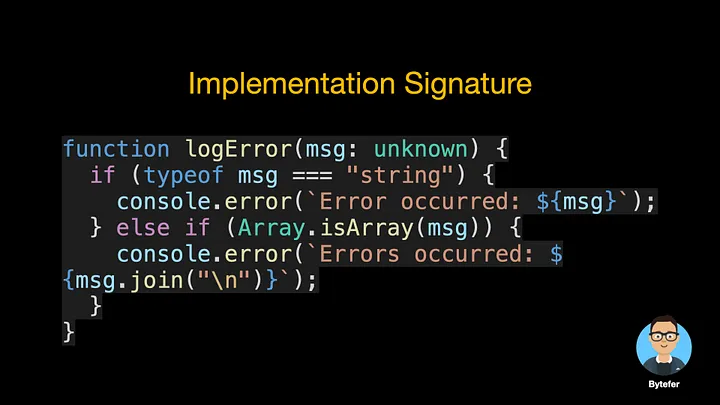
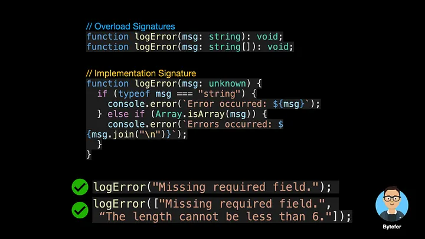
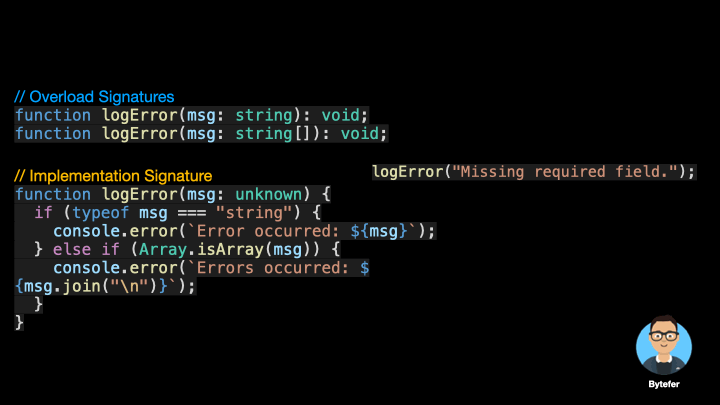
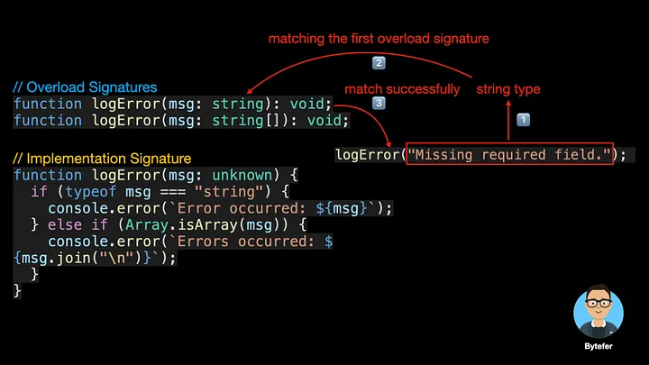

<!--
 * @Author: maxueming maxueming@kuaishou.com
 * @Date: 2023-08-16 17:22:20
 * @LastEditors: maxueming maxueming@kuaishou.com
 * @LastEditTime: 2023-09-21 16:40:06
 * @FilePath: /You-Don-t-Know-TS/vuepress/docs/theme-reco/article-1.md
 * @Description: 这是默认设置,请设置`customMade`, 打开koroFileHeader查看配置 进行设置: https://github.com/OBKoro1/koro1FileHeader/wiki/%E9%85%8D%E7%BD%AE
-->

# Typescrit 中的函数重载？

A Simple Explanation of Function Overloading in TypeScript, Helps You Understand Overload Signatures and Implementation Signature.


欢迎来到掌握 TypeScript 系列。本系列将以动画的形式介绍 TypeScript 的核心知识和技术。一起来学习吧！往期文章如下：

[English](./article-8-en.md)

- [What Are K, T, and V in TypeScript Generics?](article-1-en.md)
- [Using TypeScript Mapped Types Like a Pro](article-1-en.md)
- [Using TypeScript Conditional Types Like a Pro](article-1-en.md)
- [Using TypeScript Intersection Types Like a Pro](article-1-en.md)
- [Using TypeScript infer Like a Prov](article-1-en.md)
- [Using TypeScript Template Literal Types Like a Prov](article-1-en.md)
- [TypeScript Visualized: 15 Most Used Utility Types](./Advanced-2.md)
- [10 Things You Need To Know About TypeScript Classes](article-1-en.md)
- [The Purpose of ‘declare’ Keyword in TypeScript](article-1-en.md)
- [How To Define Objects Type With Unknown Structures in TypeScript](article-1-en.md)

你知道为什么下图中定义了这么多 ref 函数以及它们的作用吗？如果你还不清楚，看完本文的内容，或许你就会明白了。


这是一个简单的 logError 函数，接受一个字符串类型参数，用于输出错误信息。

```typescript
function logError(msg: string) {
  console.error(`Error occurred: ${msg}`);
}
logError("Missing required field.");
```

现在问题来了，如果我们希望 logError 函数支持数组形式的多个错误消息怎么办？给你几秒钟的时间思考一下，你有答案了吗？


解决方案之一是使用联合类型：

```typescript
function logError(msg: string | string[]) {
  if (typeof msg === "string") {
    console.error(`Error occurred: ${msg}`);
  } else if (Array.isArray(msg)) {
    console.error(`Errors occurred: ${msg.join("\n")}`);
  }
}
logError("Missing required field.");
logError(["Missing required field.", "The length cannot be less than 6."]);
```

而另一种解决方案是使用函数重载，使用函数重载技术，我们需要定义重载签名和实现签名。


重载签名定义了函数中每个参数的类型以及函数的返回值类型，但不包含函数体。一个函数可以有多个重载签名。


实现签名的参数类型和返回值类型需要使用更通用的类型，并且还包含实现签名的函数体。一个函数只能有一个实现签名。



将重载签名和实现签名结合起来，我们就实现了上面提到的功能：



请注意，只有重载签名是可调用的。当 TypeScript 编译器处理函数重载时，它会查找重载列表并尝试使用第一个重载定义。如果匹配则立即返回。





当使用与实现签名对应的类型的参数调用实现签名函数时，会发生错误。


除了重载函数之外，我们还可以重载类中的方法。方法重载是调用同一个类中具有相同名称和不同参数（参数类型不同、参数个数不同或参数个数相同时参数顺序不同）的方法，并且该方法被调用的技术。匹配时选择按照实参数的形式进行运算。

我们来看一个方法重载的例子：

```typescript
class Calculator {
  add(a: number, b: number): number;
  add(a: string, b: string): string;
  add(a: string, b: number): string;
  add(a: number, b: string): string;
  add(a: string | number, b: string | number) {
    if (typeof a === "string" || typeof b === "string") {
      return a.toString() + b.toString();
    }
    return a + b;
  }
}
const calculator = new Calculator();
const result = calculator.add("Bytefer", " Kakuqo");
```

读完这篇文章你应该知道，Vue3 反应性模块中的 ref 函数后面使用了函数重载技术。

如果你想学习 TypeScript，那么不要错过掌握 TypeScript 系列。
