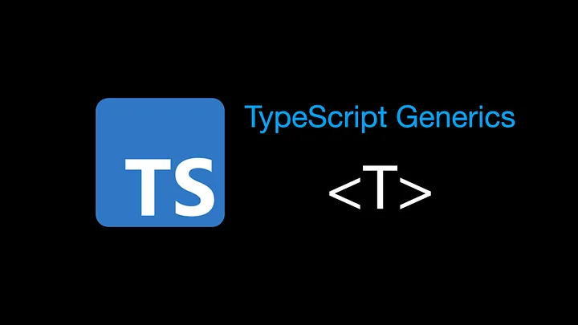
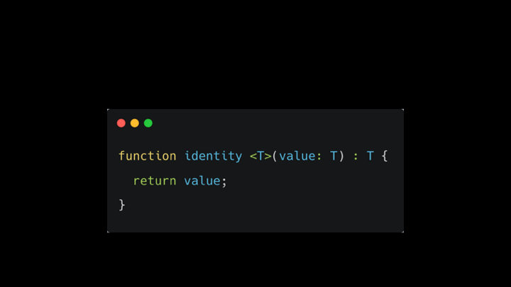
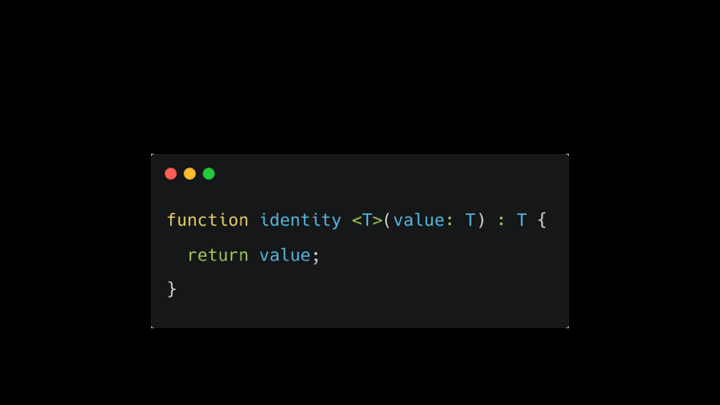
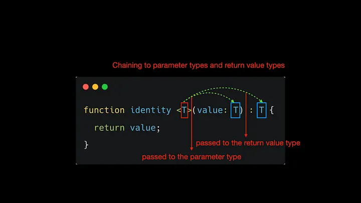
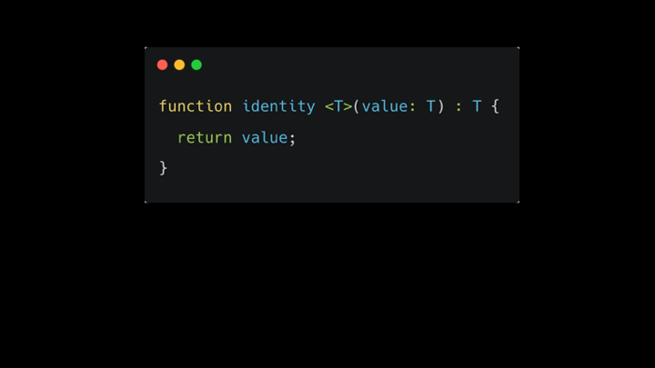
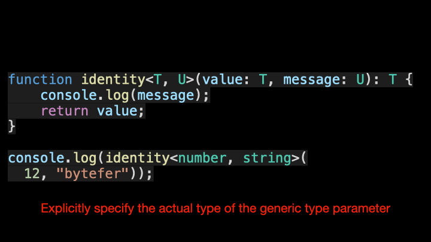
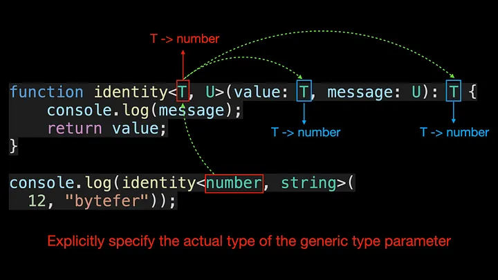
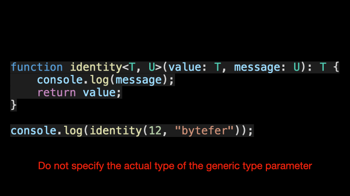
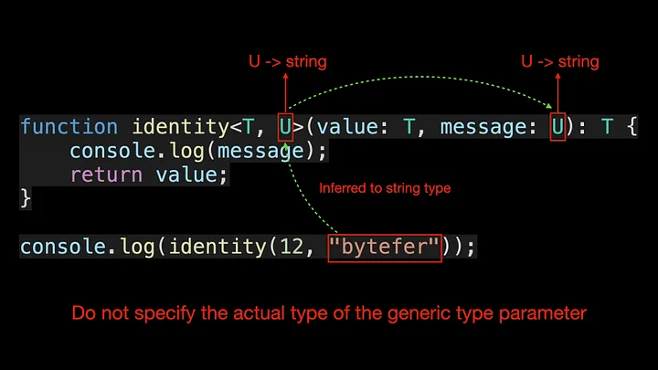

<!--
 * @Author: maxueming maxueming@kuaishou.com
 * @Date: 2023-08-16 17:22:20
 * @LastEditors: maxueming maxueming@kuaishou.com
 * @LastEditTime: 2023-08-16 18:20:16
 * @FilePath: /You-Don-t-Know-TS/vuepress/docs/theme-reco/article-1.md
 * @Description: 这是默认设置,请设置`customMade`, 打开koroFileHeader查看配置 进行设置: https://github.com/OBKoro1/koro1FileHeader/wiki/%E9%85%8D%E7%BD%AE
-->

# TypeScript 泛型中的 K、T 和 V 是什么？

欢迎来到掌握 TypeScript 系列。本系列将以动画的形式介绍 TypeScript 的核心知识和技术。一起来学习吧！往期文章如下：

[英文版本](./article-1-en.md)

- [What Are K, T, and V in TypeScript Generics?](article-1.md)
- [Using TypeScript Mapped Types Like a Pro](article-1.md)
- [Using TypeScript Conditional Types Like a Pro](article-1.md)
- [Using TypeScript Intersection Types Like a Pro](article-1.md)
- [Using TypeScript infer Like a Prov](article-1.md)
- [Using TypeScript Template Literal Types Like a Prov](article-1.md)
- [TypeScript Visualized: 15 Most Used Utility Types](./Advanced-2.md)
- [10 Things You Need To Know About TypeScript Classes](article-1.md)
- [The Purpose of ‘declare’ Keyword in TypeScript](article-1.md)
- [How To Define Objects Type With Unknown Structures in TypeScript](article-1.md)

当你第一次看到 TypeScript 泛型中的 `T` 时，是不是觉得很奇怪？

该公式称为泛型类型参数，它是我们希望传递给恒等函数的类型占位符。

就像传递参数一样，我们获取用户指定的实际类型并将其链接到参数类型和返回值类型。

那么 `T` 是什么意思呢？图中的泛型类型参数 `T` 代表 `Type`，实际上 `T` 可以替换为任何有效的名称。除了 `T` 之外，常见的泛型变量还有 `K`、`V`、`E` 等。

- K(Key)：表示对象中 key 的类型
- V(Value)：表示对象中值的类型
- E(Element)：表示元素类型

当然，你不必只定义一个类型参数，你可以引入任意数量的类型参数。这里我们引入一个新的类型参数 U，它扩展了我们定义的恒等函数。

在调用 identity 函数时，我们可以显式指定泛型参数的实际类型。当然，你也可以不指定泛型参数的类型，让 TypeScript 自动帮我们完成类型推断。

看完上面的动画，你是否已经了解泛型类型参数了？

If you like to learn TypeScript in the form of animation, you can follow me on Medium or Twitter to read more about TS and JS!
