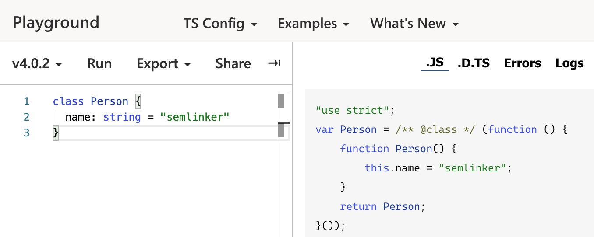

## 一、什么是 typescript？

TypeScript 是一种由微软开发的自由和开源的编程语言。它是 JavaScript 的一个超集，而且本质上向这个语言添加了可选的静态类型和基于类的面向对象编程。
::: tip
TypeScript 提供最新的和不断发展的 JavaScript 特性，包括那些来自 2015 年的 ECMAScript 和未来的提案中的特性，比如异步功能和 Decorators，以帮助建立健壮的组件。下图显示了 TypeScript 与 ES5、ES2015 和 ES2016 之间的关系：
:::


### 1.1 typescript 与 javascript 区别

|                   TypeScript                   |                  JavaScript                  |
| :--------------------------------------------: | :------------------------------------------: |
| JavaScript 的超集用于解决大型项目的代码复杂性  |        一种脚本语言，用于创建动态网页        |
|          可以在编译期间发现并纠正错误          |   作为一种解释型语言，只能在运行时发现错误   |
|           强类型，支持静态和动态类型           |           弱类型，没有静态类型选项           |
| 最终被编译成 JavaScript 代码，使浏览器可以理解 |            可以直接在浏览器中使用            |
|              支持模块、泛型和接口              |            不支持模块，泛型或接口            |
|       社区的支持仍在增长，而且还不是很大       | 大量的社区支持以及大量文档和解决问题的支持｜ |

### 1.2 获取 TypeScript

命令行的 TypeScript 编译器可以使用 npm 包管理器来安装。

- 1.安装 TypeScript
  ```
  $ npm install -g typescript
  ```
- 2.验证 TypeScript

```
  $ tsc -v
# Version 4.0.2
```

- 3.编译 TypeScript 文件

```
  $ tsc helloworld.ts

# helloworld.ts => helloworld.js
```

当然，对刚入门 TypeScript 的小伙伴来说，也可以不用安装 typescript，而是直接使用线上的 [TypeScript Playground](https://www.typescriptlang.org/play/) 来学习新的语法或新特性。通过配置 TS Config 的 Target，可以设置不同的编译目标，从而编译生成不同的目标代码。

下图示例中所设置的编译目标是 ES5：


### 1.3 典型 Typescript 编译流程


如你所见，在上图中包含 3 个 ts 文件：a.ts、b.ts 和 c.ts。这些文件将被 TypeScript 编译器，根据配置的编译选项编译成 3 个 js 文件，即 a.js、b.js 和 c.js。对于大多数使用 TypeScript 开发的 Web 项目，我们还会对编译生成的 js 文件进行打包处理，然后在进行部署。

### 1.4 Typescript 初体验

新建一个 hello.ts 文件，并输入以下内容：

```typescript
function greet(person: string) {
  return "Hello, " + person;
}

console.log(greet("TypeScript"));
```

然后执行 tsc hello.ts 命令，之后会生成一个编译好的文件 hello.js：

```typescript
"use strict";
function greet(person) {
  return "Hello, " + person;
}
console.log(greet("TypeScript"));
```

观察以上编译后的输出结果，我们发现 person 参数的类型信息在编译后被擦除了。TypeScript 只会在编译阶段对类型进行静态检查，如果发现有错误，编译时就会报错。而在运行时，编译生成的 JS 与普通的 JavaScript 文件一样，并不会进行类型检查。
