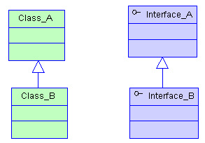

## 十一、typescript 类

### 11.1 类的属性与方法

在面向对象语言中，类是一种面向对象计算机编程语言的构造，是创建对象的蓝图，描述了所创建的对象共同的属性和方法。

在 TypeScript 中，我们可以通过 Class 关键字来定义一个类：

```typescript
class Greeter {
  // 静态属性
  static cname: string = "Greeter";
  // 成员属性
  greeting: string;

  // 构造函数 - 执行初始化操作
  constructor(message: string) {
    this.greeting = message;
  }

  // 静态方法
  static getClassName() {
    return "Class name is Greeter";
  }

  // 成员方法
  greet() {
    return "Hello, " + this.greeting;
  }
}

let greeter = new Greeter("world");
```

那么成员属性与静态属性，成员方法与静态方法有什么区别呢？这里无需过多解释，我们直接看一下编译生成的 ES5 代码：

```typescript
"use strict";
var Greeter = /** @class */ (function () {
  // 构造函数 - 执行初始化操作
  function Greeter(message) {
    this.greeting = message;
  }
  // 静态方法
  Greeter.getClassName = function () {
    return "Class name is Greeter";
  };
  // 成员方法
  Greeter.prototype.greet = function () {
    return "Hello, " + this.greeting;
  };
  // 静态属性
  Greeter.cname = "Greeter";
  return Greeter;
})();
var greeter = new Greeter("world");
```

### 11.2 ECMAScript 私有字段

在 TypeScript 3.8 版本就开始支持 ECMAScript 私有字段，使用方式如下：

```typescript
class Person {
  #name: string;

  constructor(name: string) {
    this.#name = name;
  }

  greet() {
    console.log(`Hello, my name is ${this.#name}!`);
  }
}

let semlinker = new Person("Semlinker");

semlinker.#name;
//     ~~~~~
// Property '#name' is not accessible outside class 'Person'
// because it has a private identifier.
```

与常规属性（甚至使用 private 修饰符声明的属性）不同，私有字段要牢记以下规则：

- > 私有字段以 # 字符开头，有时我们称之为私有名称；
- > 每个私有字段名称都唯一地限定于其包含的类；
- > 不能在私有字段上使用 TypeScript 可访问性修饰符（如 public 或 private）；
- > 私有字段不能在包含的类之外访问，甚至不能被检测到。

### 11.3 访问器

在 TypeScript 中，我们可以通过 getter 和 setter 方法来实现数据的封装和有效性校验，防止出现异常数据。

```typescript
let passcode = "Hello TypeScript";

class Employee {
  private _fullName: string;

  get fullName(): string {
    return this._fullName;
  }

  set fullName(newName: string) {
    if (passcode && passcode == "Hello TypeScript") {
      this._fullName = newName;
    } else {
      console.log("Error: Unauthorized update of employee!");
    }
  }
}

let employee = new Employee();
employee.fullName = "Semlinker";
if (employee.fullName) {
  console.log(employee.fullName);
}
```

### 11.4 类的继承

继承（Inheritance）是一种联结类与类的层次模型。指的是一个类（称为子类、子接口）继承另外的一个类（称为父类、父接口）的功能，并可以增加它自己的新功能的能力，继承是类与类或者接口与接口之间最常见的关系。

继承是一种 is-a 关系：



在 TypeScript 中，我们可以通过 extends 关键字来实现继承：

```typescript
class Animal {
  name: string;

  constructor(theName: string) {
    this.name = theName;
  }

  move(distanceInMeters: number = 0) {
    console.log(`${this.name} moved ${distanceInMeters}m.`);
  }
}

class Snake extends Animal {
  constructor(name: string) {
    super(name); // 调用父类的构造函数
  }

  move(distanceInMeters = 5) {
    console.log("Slithering...");
    super.move(distanceInMeters);
  }
}

let sam = new Snake("Sammy the Python");
sam.move();
```

### 11.5 抽象类

使用 abstract 关键字声明的类，我们称之为抽象类。抽象类不能被实例化，因为它里面包含一个或多个抽象方法。所谓的抽象方法，是指不包含具体实现的方法：

```typescript
abstract class Person {
  constructor(public name: string) {}

  abstract say(words: string): void;
}

// Cannot create an instance of an abstract class.(2511)
const lolo = new Person(); // Error
```

抽象类不能被直接实例化，我们只能实例化实现了所有抽象方法的子类。具体如下所示：

```typescript
abstract class Person {
  constructor(public name: string) {}

  // 抽象方法
  abstract say(words: string): void;
}

class Developer extends Person {
  constructor(name: string) {
    super(name);
  }

  say(words: string): void {
    console.log(`${this.name} says ${words}`);
  }
}

const lolo = new Developer("lolo");
lolo.say("I love ts!"); // lolo says I love ts!
```

### 11.6 类方法重载

在前面的章节，我们已经介绍了函数重载。对于类的方法来说，它也支持重载。比如，在以下示例中我们重载了 ProductService 类的 getProducts 成员方法：

```typescript
class ProductService {
  getProducts(): void;
  getProducts(id: number): void;
  getProducts(id?: number) {
    if (typeof id === "number") {
      console.log(`获取id为 ${id} 的产品信息`);
    } else {
      console.log(`获取所有的产品信息`);
    }
  }
}

const productService = new ProductService();
productService.getProducts(666); // 获取 id 为 666 的产品信息
productService.getProducts(); // 获取所有的产品信息
```
