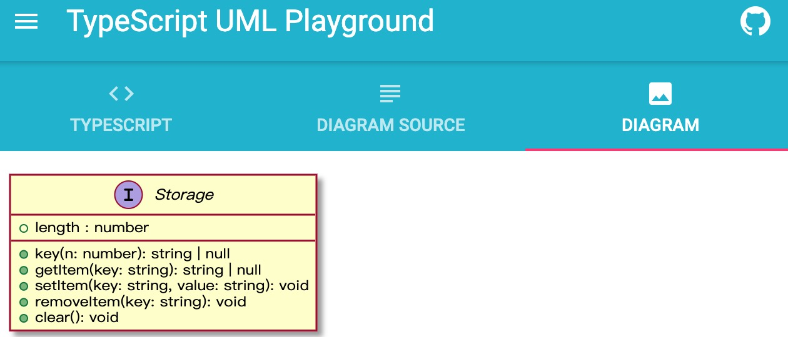
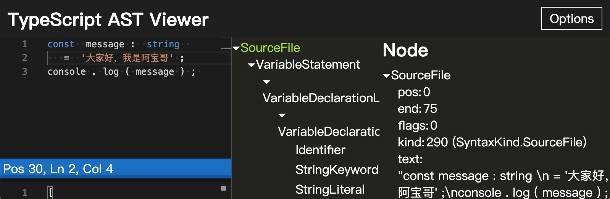

## 十六、typescript 开发辅助函数

### 16.1 TypeScript Playground

简介：TypeScript 官方提供的在线 TypeScript 运行环境，利用它你可以方便地学习 TypeScript 相关知识与不同版本的功能特性。

[在线地址](https://www.typescriptlang.org/play/)

除了 TypeScript 官方的 Playground 之外，你还可以选择其他的 Playground，比如 codepen.io、stackblitz 或 jsbin.com 等。

### 16.2 TypeScript UML Playground

简介：一款在线 TypeScript UML 工具，利用它你可以为指定的 TypeScript 代码生成 UML 类图。

[在线地址](https://tsuml-demo.firebaseapp.com/)

### 16.3 JSON TO TS

简介：一款 TypeScript 在线工具，利用它你可以为指定的 JSON 数据生成对应的 TypeScript 接口定义。

[在线地址](http://www.jsontots.com/)

除了使用 jsontots 在线工具之外，对于使用 VSCode IDE 的小伙们还可以安装 JSON to TS 扩展来快速完成 JSON to TS 的转换工作。

### 16.4 Schemats

简介：利用 Schemats，你可以基于（Postgres，MySQL）SQL 数据库中的 schema 自动生成 TypeScript 接口定义。

[在线地址](https://github.com/SweetIQ/schemats)

### 16.5 TypeScript AST Viewer

简介：一款 TypeScript AST 在线工具，利用它你可以查看指定 TypeScript 代码对应的 AST（Abstract Syntax Tree）抽象语法树。

[在线地址](https://ts-ast-viewer.com/)

对于了解过 AST 的小伙伴来说，对 astexplorer 这款在线工具应该不会陌生。该工具除了支持 JavaScript 之外，还支持 CSS、JSON、RegExp、GraphQL 和 Markdown 等格式的解析。

### 16.6 TypeDoc

简介：TypeDoc 用于将 TypeScript 源代码中的注释转换为 HTML 文档或 JSON 模型。它可灵活扩展，并支持多种配置。

[在线地址](https://typedoc.org/)

### 16.7 TypeScript ESLint

简介：使用 TypeScript ESLint 可以帮助我们规范代码质量，提高团队开发效率。

[在线地址](https://typescript-eslint.io/)

对 TypeScript ESLint 项目感兴趣且想在项目中应用的小伙伴，可以参考 “在 Typescript 项目中，如何优雅的使用 ESLint 和 Prettier” 这篇文章。

能坚持看到这里的小伙伴都是 “真爱”，如果你还意犹未尽，那就来看看本人整理的 Github 上 1.8K+ 的开源项目：awesome-typescript。
https://github.com/semlinker/awesome-typescript
